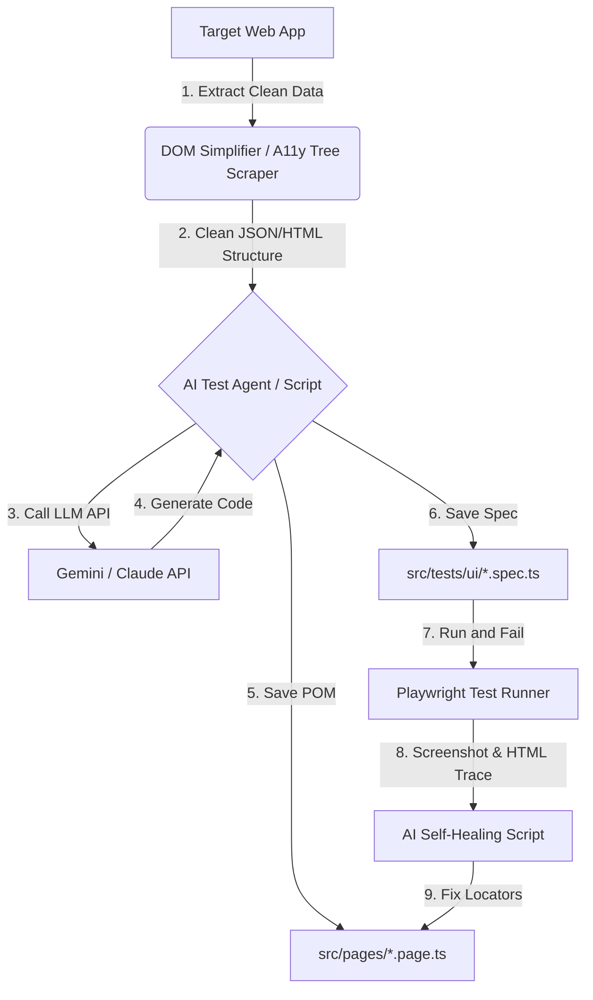

# AI-Driven UI Testing Plan

This document outlines the current state of Playwright in your repository and provides a complete architectural blueprint to enable **AI-driven UI test generation, automated Page Object creation, and self-healing tests** for complex DOM structures.

---

## 1. Current State Assessment

### Do we have an MCP Server related to Playwright?
* **No.** There are no Model Context Protocol (MCP) server definitions or configuration files (like `mcp-servers.json` or custom Node.js MCP server files) related to Playwright inside this repository.

### Do we have all required elements for AI-driven testing?
* **No.** While you have a solid boilerplate for Playwright UI/API testing (Page Object Model, base pages, typescript compilation, allure reporting, and custom utility functions), you are missing the **glue scripts, DOM processors, LLM API integrations, and developer tooling** needed to generate or heal tests automatically using AI.

---

## 2. Recommended Approach: AI-Powered Test Automation

To create UI tests for complex DOMs faster and automatically with AI, we can build a lightweight local AI toolkit. The solution consists of four primary components:

### Component A: The DOM Simplifier & Accessibility (A11y) Tree Scraper
* **The Problem:** Dynamic and complex websites have huge DOMs with inline CSS, script tags, SVG vectors, and nested `
`s that bloat token count and confuse AI models.
* **The Solution:** A Node/TypeScript script that navigates to a URL (or uses an active Playwright browser instance) and extracts:
  1. The **Accessibility Tree** (using Playwright's `page.accessibility.snapshot()`). This captures how screen readers see the page (roles like `button`, `textbox`, `combobox` with their labels), which represents the cleanest interface for generating robust, resilient locators.
  2. A **Cleaned DOM**: A stripped-down HTML string containing *only* interactive elements (e.g. `<button>`, `<input>`, `<a>`, `<select>`) along with their unique attributes (like `id`, `name`, `data-testid`, `placeholder`, `aria-*` tags, and class names).

### Component B: AI Page Object Model (POM) Generator
* **The Solution:** A script `npm run ai-gen-pom <url_or_html_file> <page_name>` that:
  1. Reads the cleaned DOM/Accessibility Tree representation of the page.
  2. Constructs a prompt incorporating your repository's exact coding conventions (e.g. extending `BasePage` from `playwright-utils`, using private getters for `Locator` objects, and public async methods for interaction).
  3. Sends this to the LLM API (e.g., Gemini).
  4. Automatically writes a syntactically correct TypeScript page object file in `src/pages/`.

### Component C: AI Test Spec Generator
* **The Solution:** A script `npm run ai-gen-spec "<user_story_description>"` that:
  1. Inspects your existing page objects in `src/pages/` (extracts their class names and method signatures to provide as context to the AI).
  2. Asks the AI to write a Playwright spec file matching the user story (e.g. "verify complete book purchase") using the available page objects.
  3. Formats the test steps inside standard `await test.step('Step name', async () => { ... })` blocks matching your style.

### Component D: AI Self-Healing Tool
* **The Solution:** A test execution wrapper `npm run ai-test-heal <spec_file>` that:
  1. Runs the specified test suite.
  2. If a locator fails or a timeout occurs, captures the **screenshot**, **console logs**, and **current simplified HTML** at the point of failure.
  3. Sends this error payload to the LLM.
  4. The LLM identifies the correct updated selector and automatically patches the broken locator in the page object file.

---

## 3. Playwright MCP Server Integration

To let the AI coding assistant (like Antigravity or standard IDE chat models) interactively explore the website to write pages/tests:
1. **Model Context Protocol (MCP)** allows you to hook up the official **Playwright MCP Server** (`@modelcontextprotocol/server-playwright`).
2. When configured, the AI coding assistant can run commands to open a browser window, navigate, click, input text, and pull screenshots directly.
3. This is useful for writing tests for complex DOMs, because the AI can visually verify if its locators are correct before saving the test code.

---

## 4. Proposed Backlog of Pending Items

Here is the plan of items that are pending and needed to achieve this capability:

### Phase 1: Core Scraper & Cleaning Utilities
- [ ] **Create a DOM Scraper Utility** in `playwright-utils/src/utils/dom-cleaner.ts`.
  - Capture accessbility tree via `page.accessibility.snapshot()`.
  - Traverse the DOM tree and strip non-essential attributes/tags (styles, SVGs, scripts).
- [ ] **Define POM Template Prompts** to teach the AI how your code is structured:
  - Private getters using XPath / CSS selectors.
  - Usage of wrapper helpers (like `this.doClick`, `this.doGetText`, etc.).
  - Proper TypeScript typing and imports.

### Phase 2: CLI Scripts for AI Generation
- [ ] **Implement POM Generator Script** (`scripts/ai-generate-pom.ts`):
  - Integrate a model client (such as `@google/generative-ai` or another AI API key).
  - Feed the output of the DOM scraper to generate page classes.
- [ ] **Implement Spec Generator Script** (`scripts/ai-generate-spec.ts`):
  - Read public methods of existing page objects.
  - Allow natural language inputs to write complete E2E specs.

### Phase 3: Self-Healing & Runner Integration
- [ ] **Create Self-Healing Runner** (`scripts/ai-heal-runner.ts`):
  - Wrap the `npx playwright test` execution.
  - Parse failures, take snapshots of target pages on failure, and update locators.

### Phase 4: MCP Setup (Optional but recommended for IDEs)
- [ ] **Configure an MCP configuration file** (`.vscode/mcp-servers.json` or global config) containing `@modelcontextprotocol/server-playwright` to allow AI agents direct headless browser control.
