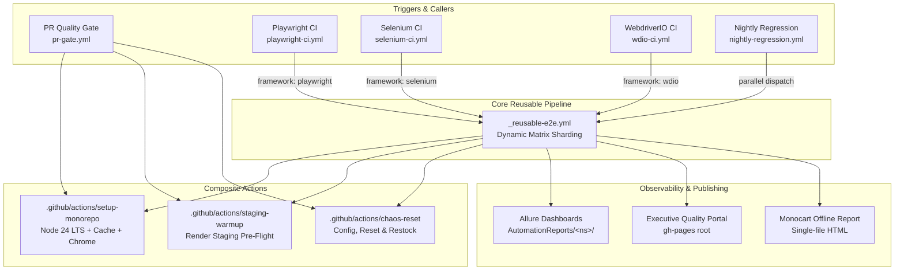

# BuggyBooks CI/CD Pipeline Architecture & Governance Map

**Navigation**: [🗺️ Master Planning Hub](../../planning/README.md) | [📊 Reporting Architecture](reporting_architecture.md) | [⚖️ Framework Comparison](framework_comparison_benchmark.md) | [Sprint 6.2 Plan](../../planning/Sprints/sprint_6_2_reusable_workflows_and_composite_actions.md)

---

## 1. Architectural Overview

Following the Sprint 6.2 modernization, the BuggyBooks test automation repository consolidates redundant GitHub Actions workflows into a modular, reusable continuous integration architecture. Redundant copy-pasted blocks (Render staging cold-start wake-up, chaos configuration reset, toolchain setup) are encapsulated into **Composite Actions**, while E2E web execution (Playwright, Selenium WebDriver, WebdriverIO) is unified under a single **Reusable E2E Workflow**.

---

## 2. Reusable E2E Pipeline Contract (`_reusable-e2e.yml`)

The reusable workflow is triggered via `workflow_call` with zero copy-pasting across caller jobs.

### Input Parameters

| Parameter | Type | Default | Description |
| :--- | :--- | :--- | :--- |
| `framework` | string | `playwright` | Automation framework target (`playwright`, `selenium`, `wdio`). |
| `project` | string | `''` | Playwright project filter (`chrome`, `api`, or blank for all). |
| `grep` | string | `''` | Regex or tag filter pattern (e.g. `@smoke`, `@regression`). |
| `shards` | number | `1` | Shard count. Playwright builds dynamic matrix `[1..N]`; Selenium/WDIO default to 1. |
| `use-docker-image` | boolean | `false` | Run inside container `mcr.microsoft.com/playwright:v1.58.0-jammy`. |
| `publish-allure` | boolean | `true` | Generate Allure dashboard and deploy to GitHub Pages. |
| `allure-namespace` | string | `Playwright` | Subdirectory destination under `AutomationReports/<namespace>/`. |
| `target-env` | string | `STAGING` | Environment configuration profile (`STAGING`, `DOCKER` in Phase 7). |
| `headless` | string | `'true'` | Run browser in headless mode. |
| `branch` | string | `''` | Specific branch reference for checkout. |

### Execution Stages

1. **Stage 1: Build Shard Matrix (`build-matrix`)**: Dynamically computes shard indices `[1, 2, ..., N]` using `node -e` outputting to GitHub Actions output parameters.
2. **Stage 2A: Host Execution (`test-host`)**: Executes on `ubuntu-latest` with cached Google Chrome binaries when `use-docker-image: false`.
3. **Stage 2B: Docker Execution (`test-docker`)**: Executes inside official Playwright Docker container when `use-docker-image: true`.
4. **Stage 3: Report Merging (`merge-reports`)**: Merges sharded blob reports, Monocart reports, Allure results, and generates honest step summaries via `scripts/summarize-test-results.js`.
5. **Stage 4: Pages Deployment (`deploy-report`)**: Deploys namespaced Allure report with preserved historical trend charts (`history/`), regenerates executive portal metadata (`scripts/generate-portal-metadata.js`), and deploys root portal under Pages concurrency locks.

---

## 3. Workflow Retirement & Migration Log

Prior to Sprint 6.2, three separate Playwright workflows existed with overlapping responsibilities. Both redundant workflows were retired and consolidated into `_reusable-e2e.yml`:

| Retired Workflow | Baseline LOC | Key Capabilities | Consolidated Target in `_reusable-e2e.yml` |
| :--- | :---: | :--- | :--- |
| `playwright-docker.yml` | 234 | Containerized execution in Playwright Jammy, 8 native shards. | `use-docker-image: true`, `shards: 8`. |
| `playwright-on-demand.yml` | 608 | Filter by tag/path/project, separate API/UI runs, custom retry/workers. | Call `_reusable-e2e.yml` with `project: <proj>`, `grep: <tag>`, `shards: <N>`. |
| `playwright-ci.yml` | 160 | Standard push/dispatch CI runner. | Refactored to thin caller (54 lines) calling `_reusable-e2e.yml`. |

**Total Reduction**: E2E workflow code reduced from **1,314 LOC** to **686 LOC** (**48% line reduction**).

---

## 4. Composite Actions Inventory

Located under `.github/actions/`:

### A. `setup-monorepo` (`.github/actions/setup-monorepo/action.yml`)
- Standardizes Node.js version across all monorepo jobs using root `.nvmrc` (Node 24 LTS).
- Enables npm dependency caching based on root `package-lock.json`.
- Conditionally installs and caches Google Chrome browser binaries (`~/.cache/ms-playwright`) keyed on lockfile hashes and runner OS.

### B. `staging-warmup` (`.github/actions/staging-warmup/action.yml`)
- Mitigates free-tier Render sleeping instance latency (30–60s cold-start).
- Probes backend (`/api/books`) and frontend (`/`) with 90-second timeout using `npx wait-on`.
- Strictly prevents command template injection by passing all inputs through environment variables.

### C. `chaos-reset` (`.github/actions/chaos-reset/action.yml`)
- Resets intentional chaos parameters (`checkoutFailureRate: 0`, `inventoryDelayMs: 0`, `visualChaos: false`).
- Invokes application state reset (`POST /api/test/reset`).
- Restores catalog inventory for books 1 and 2 to clean stock baseline (`100`).

---

## 5. Security & Toolchain Governance

1. **Full Commit SHA Pinning**: All third-party GitHub Actions (`actions/*`, `peaceiris/*`, `grafana/*`, `reactivecircus/*`) are pinned to 40-character commit SHAs with version comments (`# vX.Y.Z`).
2. **Template Injection Defense**: No GitHub Actions input expressions (`${{ inputs.* }}`) are directly interpolated into `run:` scripts. All inputs are mapped to step-level `env:` variables before script execution.
3. **Least-Privilege Permissions**: Workflows default to `permissions: { contents: read }`. Elevated permissions (`contents: write`, `pages: write`, `id-token: write`) are strictly confined to report deployment jobs.
4. **Outcome Gating**: Test step outcomes (`steps.tests.outcome == 'failure'`) are verified with terminal exit 1 steps to ensure failing tests never produce false-positive green CI badges.
