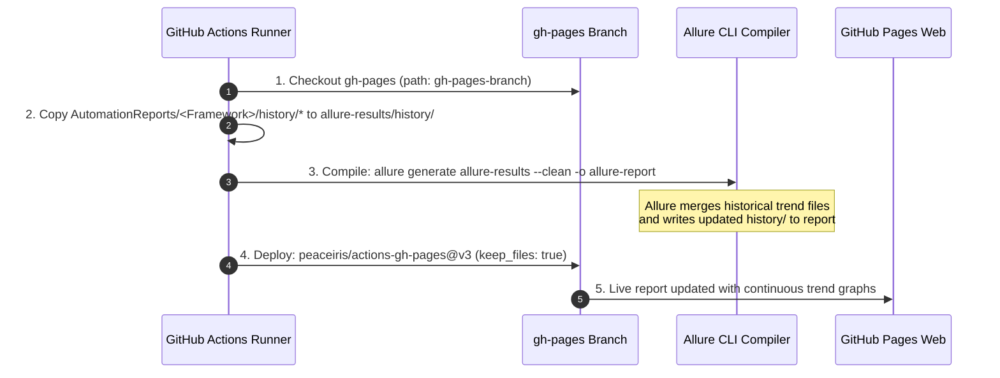

# Multi-Framework Allure Result Aggregation & Reporting Architecture

## 1. Executive Overview & Strategic Motivation

The **BuggyBooks** automated testing ecosystem encompasses multiple industry-standard test automation frameworks across diverse execution domains:
- **`playwright-e2e/`**: Primary E2E and pure HTTP API automation framework (Playwright, TypeScript).
- **`selenium-e2e/`**: W3C-compliant browser automation (Selenium WebDriver, TypeScript, Mocha, Chai).
- **`wdio-e2e/`**: Modern web automation with Shadow DOM piercing (WebdriverIO, TypeScript, Mocha).
- **`mobile-automation/`**: Android (`UiAutomator2`) & iOS (`XCUITest`) mobile automation (Appium 2.x, WebdriverIO).
- **`jmeter/`**: Enterprise load and stress testing test plans (Apache JMeter 5.6+).
- **`k6-performance/`**: Developer performance benchmarking and PR drift regression gates.

Prior to Sprint 5.1, each framework generated its own reporting artifacts in inconsistent locations (`reports/allure-results`, `allure-results/`, `jmeter/Reports/`), and CI deployments clobbered each other or deposited unrendered reports in temporary artifact zip files.

**Sprint 5.1** formalizes a unified, namespaced Allure reporting architecture that:
1. **Standardizes Results Directories**: Enforces `<workspace>/allure-results/` across all web and mobile frameworks.
2. **Generates Standardized Metadata**: Populates `environment.properties` with uniform browser, driver, OS, and staging environment details.
3. **Preserves Historical Trends**: Seamlessly injects historical trend files (`history/`) from previous CI deployments to maintain unbroken pass-rate and duration charts.
4. **Partitions Namespaces on GitHub Pages**: Deploys all reports under dedicated paths (`AutomationReports/<Framework>/`) using `peaceiris/actions-gh-pages@v3` with `keep_files: true`, preventing cross-framework data loss.
5. **Prevents Deployment Race Conditions**: Employs GitHub Actions concurrency groups (`pages-deploy-allure`) to ensure sequential, collision-free updates to `gh-pages`.

---

## 2. Global Directory Hierarchy & Namespacing Architecture

### A. Local Framework Output Hierarchy
Every framework writes raw JSON/XML test result artifacts to its root `allure-results/` directory:

```text
c:\Workspace\AutomationFrameworks/
├── playwright-e2e/
│   ├── allure-results/              # Raw Playwright test results & environment.properties
│   └── allure-report/               # Generated standalone HTML report (ephemeral)
├── selenium-e2e/
│   ├── allure-results/              # Raw Mocha Allure results & environment.properties
│   └── allure-report/               # Generated standalone HTML report (ephemeral)
├── wdio-e2e/
│   ├── allure-results/              # Raw WDIO Allure results & environment.properties
│   └── allure-report/               # Generated standalone HTML report (ephemeral)
├── mobile-automation/
│   ├── allure-results/              # Raw Mobile Appium Allure results & environment.properties
│   └── allure-report/               # Generated standalone HTML report (ephemeral)
├── jmeter/
│   └── Reports/                     # Apache JMeter HTML dashboards
└── scripts/
    └── generate-allure-environment.js  # Centralized environment metadata generator
```

### B. Remote GitHub Pages Publishing Namespaces
All framework dashboards publish to isolated subdirectories on the `gh-pages` branch, hosted at the canonical GitHub Pages domain:

```text
https://<owner>.github.io/<repo>/
└── AutomationReports/
    ├── Playwright/                  # Playwright Chrome UI & API Allure Dashboard
    │   ├── index.html
    │   ├── data/
    │   ├── history/                 # Preserved historical run trends
    │   └── widgets/
    ├── JMeter/                      # Apache JMeter HTML Dashboard
    │   ├── index.html
    │   ├── content/
    │   └── statistics.json
    ├── Selenium/                    # Selenium WebDriver Allure Dashboard
    │   ├── index.html
    │   ├── history/
    │   └── ...
    ├── WDIO/                        # WebdriverIO Allure Dashboard
    │   ├── index.html
    │   ├── history/
    │   └── ...
    ├── Mobile/                      # Appium Mobile Allure Dashboard
    │   ├── index.html
    │   ├── history/
    │   └── ...
    └── k6/                          # k6 Performance Benchmarking Reports
```

---

## 3. Environment Metadata Standardization (`environment.properties`)

Allure displays an **Environment** widget on the overview dashboard summarizing runtime conditions. To maintain absolute consistency across all test suites, metadata is captured in standard Java properties format (`key=value`):

### A. Core Property Schema

| Property Key | Description | Example Value |
| :--- | :--- | :--- |
| `Framework` | Automation engine and test runner | `Playwright`, `Selenium WebDriver (TypeScript + Mocha)` |
| `Framework.Version` | Primary framework version | `^1.58.0`, `^4.43.0`, `^9.0.0` |
| `Test.Environment` | Target deployment environment | `STAGING`, `INTEROP`, `LOCAL` |
| `Base.URL` | Frontend application under test | `https://buggy-books-fe.onrender.com/` |
| `API.Base.URL` | Backend REST API host | `https://buggy-books.onrender.com` |
| `Browser.Target` | Target browser engine / channel | `Google Chrome (channel: chrome)` |
| `Headless.Mode` | Headless execution flag | `true` |
| `Operating.System` | Runner OS platform and architecture | `linux (x64)`, `win32 (x64)`, `darwin (arm64)` |
| `Node.Version` | Runtime Node.js version | `v24.13.0`, `v20.17.0` |
| `CI.Runner` | CI workflow run ID and trigger ref | `GitHub Actions (Run #42, Ref: refs/heads/main)` |
| `Timestamp` | ISO 8601 generation timestamp | `2026-10-02T04:33:37.320Z` |

### B. Automated Generator Utility
The monorepo provides a dedicated Node.js generator script at [`scripts/generate-allure-environment.js`](../../scripts/generate-allure-environment.js) that can be invoked across all platforms:

```bash
# Generate metadata for all frameworks
npm run generate-allure:env

# Generate metadata for a specific framework
node scripts/generate-allure-environment.js --framework=playwright
node scripts/generate-allure-environment.js --framework=selenium
node scripts/generate-allure-environment.js --framework=wdio
node scripts/generate-allure-environment.js --framework=mobile
```

### C. Runtime In-Framework Hooks
In addition to the standalone CLI generator, each framework automatically generates or enriches environment metadata at runtime:
1. **Playwright**: Configured via `environmentInfo` inside `allure-playwright` in [`playwright-e2e/src/config/playwright.config.ts`](../../playwright-e2e/src/config/playwright.config.ts).
2. **Selenium**: Created automatically during browser initialization in `BaseTest.setup()` in [`selenium-e2e/src/core/base/base.test.ts`](../../selenium-e2e/src/core/base/base.test.ts).
3. **WebdriverIO**: Configured via `onPrepare` hook in [`wdio-e2e/src/config/wdio.conf.ts`](../../wdio-e2e/src/config/wdio.conf.ts).
4. **Mobile (Appium)**: Configured via `onPrepare` hook in [`mobile-automation/src/config/wdio.shared.conf.ts`](../../mobile-automation/src/config/wdio.shared.conf.ts).

---

## 4. Historical Trend Retention Architecture (`history/`)

### The Ephemeral CI Dilemma
GitHub Actions runners are ephemeral containers that destroy all local filesystem data upon job completion. Without an explicit trend-injection step, every Allure generation starts with run count `#1`, erasing previous build trends, duration fluctuations, and flakiness metrics.

### The 4-Step Closed-Loop History Mechanism
To preserve historical trends across builds without third-party external storage, CI workflows execute an automated history injection loop:



### CI Implementation Pattern
```bash
# Step A: Restore previous history from gh-pages
if [ -d "gh-pages-branch/AutomationReports/${FRAMEWORK}/history" ]; then
  echo "Found existing Allure history. Injecting into results..."
  mkdir -p ${FRAMEWORK}-allure-results/history
  cp -r gh-pages-branch/AutomationReports/${FRAMEWORK}/history/* ${FRAMEWORK}-allure-results/history/
else
  echo "No previous history found. Starting fresh trend baseline."
fi

# Step B: Compile report with merged history
allure generate ${FRAMEWORK}-allure-results --clean -o ${FRAMEWORK}-allure-report

# Step C: Deploy to namespaced directory with keep_files: true
uses: peaceiris/actions-gh-pages@v3
with:
  github_token: ${{ secrets.GITHUB_TOKEN }}
  publish_branch: gh-pages
  publish_dir: ${FRAMEWORK}-allure-report
  destination_dir: AutomationReports/${FRAMEWORK}
  keep_files: true
```

---

## 5. CI/CD Workflow Governance & Concurrency Control

### A. Workflow Inventory

| Workflow File | Target Framework | Destination Namespace | History Preserved | Concurrency Group |
| :--- | :--- | :--- | :---: | :--- |
| [`.github/workflows/playwright-ci.yml`](../../.github/workflows/playwright-ci.yml) | Playwright (Chrome UI + API) | `AutomationReports/Playwright` | Yes | `pages-deploy-allure` |
| [`.github/workflows/selenium-ci.yml`](../../.github/workflows/selenium-ci.yml) | Selenium WebDriver | `AutomationReports/Selenium` | Yes | `pages-deploy-allure` |
| [`.github/workflows/wdio-ci.yml`](../../.github/workflows/wdio-ci.yml) | WebdriverIO E2E | `AutomationReports/WDIO` | Yes | `pages-deploy-allure` |
| [`.github/workflows/mobile-ci.yml`](../../.github/workflows/mobile-ci.yml) | Appium 2.x Mobile | `AutomationReports/Mobile` | Yes | `pages-deploy-allure` |
| [`.github/workflows/jmeter-performance.yaml`](../../.github/workflows/jmeter-performance.yaml) | Apache JMeter 5.6+ | `AutomationReports/JMeter` | N/A (Static HTML) | `pages-deploy-allure` |

### B. Concurrency Mutex Locks
Because multiple workflows or framework jobs can trigger concurrently on `main` or via `workflow_dispatch`, deploying directly to Git references without synchronization can produce `non-fast-forward` ref collision errors.

All publishing workflows declare:
```yaml
concurrency:
  group: pages-deploy-allure
  cancel-in-progress: false
```
- `group: pages-deploy-allure`: Ensures all report deployment jobs share a single mutex queue.
- `cancel-in-progress: false`: Ensures pending deployments wait their turn rather than canceling previous builds, guaranteeing that every completed run publishes its results.

---

## 6. Local Development & Verification Guide

Developers and SDETs can generate and inspect reports locally using standard npm commands:

### A. Playwright
```bash
# 1. Run Playwright tests
npm run test:smoke --workspace=playwright-e2e

# 2. Compile and open Allure report
npm run report --workspace=playwright-e2e
```

### B. Selenium WebDriver
```bash
# 1. Run Selenium smoke suite
npm run test:smoke --workspace=selenium-e2e

# 2. Compile and open Allure report
npm run report --workspace=selenium-e2e
```

### C. WebdriverIO
```bash
# 1. Run WDIO smoke suite
npm run test:smoke --workspace=wdio-e2e

# 2. Compile and open Allure report
npm run report --workspace=wdio-e2e
```

### D. Mobile (Appium)
```bash
# 1. Run Mobile smoke specs (requires Android emulator or connected device)
npm run test:mobile:smoke

# 2. Compile Allure report
npm run report:allure --workspace=mobile-automation
```

---

## 7. Next Steps & Phase 5 Integration

With the standardized Allure result aggregation architecture in place:
1. **[Sprint 5.2: GitHub Pages Portal Landing Page & Executive KPI Badging](../Sprints/sprint_5_2_github_pages_portal_landing_page_and_kpi_badging.md)**: Authors `docs/portal/index.html` at the root of GitHub Pages, providing executive cards, real-time KPI badging, and seamless links to all 5 namespaced sub-reports.
2. **[Sprint 5.3: Automated Monorepo Health Auditing & Closed-Loop Governance](../Sprints/sprint_5_3_automated_monorepo_health_auditing_and_closed_loop_governance.md)**: Enforces automated dual-catalog byte parity validation in CI and establishes automated weekly quarantine flakiness audits.
