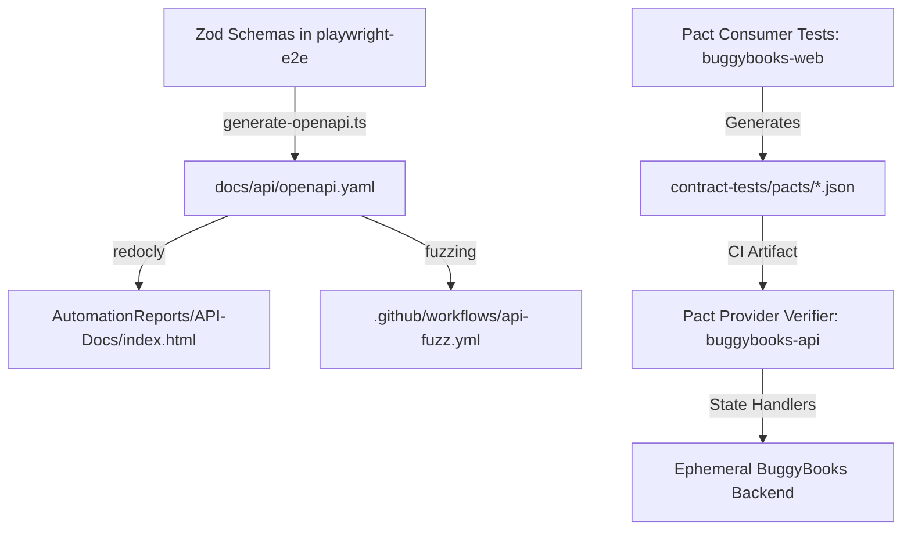

# BuggyBooks — Consumer-Driven Contract Testing & API Fuzzing Architecture

This document serves as the architectural reference for consumer-driven contract testing with **Pact** and property-based API fuzzing with **Schemathesis** in the `AutomationFrameworks` monorepo.

---

## 🧭 1. Architectural Overview & Philosophy

In modern web applications, frontend clients and backend APIs evolve asynchronously. Traditional API testing validates backend endpoints in isolation, but fails to prevent subtle drift between what the client expects and what the server returns.

BuggyBooks utilizes **Consumer-Driven Contract Testing (CDC)** with **Pact (V3/V4)** alongside **OpenAPI 3.1 Specification Generation** and **Schemathesis Property-Based Fuzzing** to enforce bi-directional contract safety:



---

## ⚖️ 2. Consumer vs. Provider Boundaries

| Role | Entity Identifier | Scope & Responsibilities |
| :--- | :--- | :--- |
| **Consumer** | `buggybooks-web` | Models exact client HTTP requests made by the frontend application (headers, paths, payloads) and asserts response shapes using flexible type matchers. |
| **Provider** | `buggybooks-api` | Replays generated contracts against the running backend server to verify that every route returns the promised status codes, headers, and payload structures. |

### Why File-Based Pacts (No Paid Broker)?

Enterprise contract testing frequently relies on commercial SaaS brokers (e.g. Pactflow). In accordance with the BuggyBooks engineering policy (**100% free and open-source tooling**):

1. **File-Based Contracts**: Consumer test suites generate versioned pact JSON files directly into `playwright-e2e/contract-tests/pacts/`.
2. **CI Artifact Sharing**: In `.github/workflows/contract-tests.yml`, the consumer job uploads `buggybooks-web-buggybooks-api.json` as a build artifact, which the provider verification job downloads and validates against the ephemeral Docker backend.
3. **Hermetic & Independent**: Eliminates SaaS costs, API token leaks, and external network dependencies.

> **Future Upgrade Option**: If multi-team branch matrixing is needed in the future, the free open-source Docker image `pactfoundation/pact-broker` can be deployed locally or in Kubernetes without paid licenses.

---

## 🧩 3. Pact Flexible Matchers Strategy

**Strict Rule**: Never assert exact hardcoded values in Pact contracts. Literal values create brittle contracts that break upon minor database seed variations. Always use Pact V3/V4 matchers:

- `MatchersV3.like(example)`: Asserts that the field exists and matches the example's primitive data type.
- `MatchersV3.eachLike(template)`: Asserts an array containing items matching the template shape (minimum length $\ge 1$).
- `MatchersV3.string(example)`: Asserts string type.
- `MatchersV3.number(example)`: Asserts numeric type (float or integer).
- `MatchersV3.integer(example)`: Asserts integer type.
- `MatchersV3.boolean(example)`: Asserts boolean type.
- `MatchersV3.regex(pattern, example)`: Asserts string value matching regex pattern.

---

## 🛠️ 4. How to Add a New Consumer Interaction

To add a new API contract interaction:

### Step 1: Author the Consumer Interaction

In `playwright-e2e/contract-tests/consumer/<domain>.consumer.spec.ts`:

```typescript
import { createPactProvider, MatchersV3 } from './pact.setup';
import axios from 'axios';

export async function runMyNewInteraction(): Promise<void> {
  const provider = createPactProvider();

  await provider
    .addInteraction({
      states: [{ description: 'target resource exists' }],
      uponReceiving: 'a request for target resource',
      withRequest: {
        method: 'GET',
        path: '/api/resource',
        headers: {
          Authorization: MatchersV3.regex('^Bearer .+', 'Bearer sample-token'),
        },
      },
      willRespondWith: {
        status: 200,
        headers: {
          'Content-Type': MatchersV3.regex('^application/json.*', 'application/json; charset=utf-8'),
        },
        body: MatchersV3.like({
          id: MatchersV3.string('res-1'),
          name: MatchersV3.string('Resource Name'),
        }),
      },
    })
    .executeTest(async (mockServer) => {
      const res = await axios.get(`${mockServer.url}/api/resource`, {
        headers: { Authorization: 'Bearer sample-token' },
      });
      if (res.status !== 200) throw new Error('Contract assertion failed');
    });
}
```

### Step 2: Register in Consumer Runner

Add the function to `playwright-e2e/contract-tests/consumer/run-consumer-tests.ts`.

### Step 3: Implement Provider State Handler

In `playwright-e2e/contract-tests/provider/provider.verify.ts`, implement the corresponding state handler:

```typescript
stateHandlers: {
  'target resource exists': async () => {
    // Call test-control endpoints to guarantee required state
    await axios.post(`${API_BASE_URL}/api/test/reset`);
    // Seed resource if needed
  },
}
```

### Step 4: Register in Dual Test Catalogs

Add the contract test ID (`CT-PACT-...`) to both:
- `docs/test_cases_catalog.md`
- `playwright-e2e/test_cases_catalog.md`

Run `npm run test:verify-catalog` to verify parity.

---

## 🛡️ 5. Provider State Handlers & Idempotency

Provider state handlers bridge contract interactions with backend reality. They must adhere to these non-negotiables:

1. **Idempotence**: Every state handler must reset previous mutations using `POST /api/test/reset`.
2. **Test-Control Only**: Use only documented chaos/test-control endpoints (`/api/test/reset`, `/api/test/books/:id/stock`, `/api/test/session/:id`).
3. **Token Injection**: The provider verifier's `requestFilter` middleware intercepts requests and injects the live authenticated JWT token and bypass headers (`x-bypass-rate-limit`, `x-bypass-csrf`).

---

## ⚡ 6. Property-Based Fuzzing with Schemathesis

Schemathesis validates the backend against the generated OpenAPI 3.1 specification (`docs/api/openapi.yaml`) using hypothesis-driven property generation:

- **Workflow**: `.github/workflows/api-fuzz.yml` (runs nightly and on manual dispatch).
- **Environment Policy**: Runs **only** against ephemeral DOCKER (`http://localhost:4000`). It is strictly prohibited from running against Render staging to prevent rate-limit starvation and noisy server log pollution.
- **Chaos Isolation**: Excludes all chaos mutation routes via `--exclude-path-regex '^/api/test/'`.
- **Checks Enforced**:
  - `not_a_server_error`: Asserts that no request produces an unhandled 5xx internal server error.
  - `status_code_conformance`: Asserts returned status codes are documented in the OpenAPI spec.
  - `content_type_conformance`: Asserts response `Content-Type` matches `application/json`.
- **Governance**: Findings are tracked under catalog ID `CT-FUZZ-001`.

---

## 🚀 7. Verification & Execution Commands

```bash
# 1. Regenerate OpenAPI spec and check for drift
npm run openapi:generate
npm run openapi:lint

# 2. Run Pact consumer contract test suite
npm run test:contract:consumer

# 3. Run Pact provider verification (requires running backend)
npm run test:contract:provider

# 4. Full contract test cycle (consumer + provider)
npm run test:contract

# 5. Dual-catalog sync check
npm run test:verify-catalog
```
