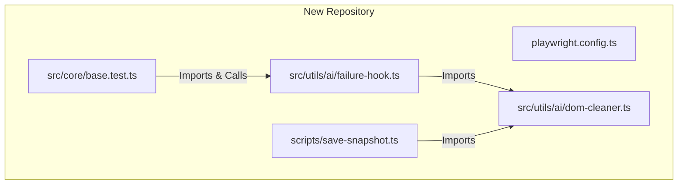

# Playwright AI Assistant Migration Guide

This guide explains how to migrate the automated Page Object Model (POM) generation, E2E test spec generation, and auto-healing capabilities into a new repository with a different folder structure.

---

## 1. File Dependency Map
Here is how the source files relate. To prevent relative-path issues in a repository with a different structure, we recommend keeping the core utility files grouped together.



### Source Files to Copy:
1. **DOM Cleaner:** [dom-cleaner.ts](file:///c:/AutomationFrameworks/playwright-e2e/src/utils/dom-cleaner.ts)
2. **Snapshot Script:** [save-snapshot.ts](file:///c:/AutomationFrameworks/playwright-e2e/scripts/save-snapshot.ts)
3. **Failure Hook:** [failure-hook.ts](file:///c:/AutomationFrameworks/playwright-e2e/src/core/base/failure-hook.ts)
4. **AI Page Object Guidelines:** [AI_POM_GUIDELINES.md](file:///c:/AutomationFrameworks/docs/AI_POM_GUIDELINES.md)
5. **AI User Guide:** [AI_TESTING_USER_GUIDE.md](file:///c:/AutomationFrameworks/docs/AI_TESTING_USER_GUIDE.md)
6. **Agent Skill:** [SKILL.md](file:///c:/AutomationFrameworks/.agents/skills/playwright-ai-assistant/SKILL.md)

---

## 2. Step-by-Step Migration

### Step 2.1: Consolidate the Utilities
Since the target repo's structure is different, place the core scripts in an `ai-utils` directory to simplify imports.

Create a folder: `<new-repo>/src/utils/ai/` and place the following two files there:

#### 1. `dom-cleaner.ts`
Copy the contents of `playwright-e2e/src/utils/dom-cleaner.ts` exactly. It contains no project-specific code and only requires `@playwright/test`.

#### 2. `failure-hook.ts`
Copy `playwright-e2e/src/core/base/failure-hook.ts` into `<new-repo>/src/utils/ai/failure-hook.ts`. 
Adjust the import on **Line 4** to reference `dom-cleaner` in the same directory:
```typescript
// Replace this:
// import { getCleanDom, getAccessibilityTree } from '../../utils/dom-cleaner';
// With this:
import { getCleanDom, getAccessibilityTree } from './dom-cleaner';
```

---

### Step 2.2: Add the CLI Snapshot Utility
Create a `scripts` folder in your Playwright folder (or root, e.g., `<new-repo>/scripts/`) and copy `save-snapshot.ts`.

#### Adjusting `save-snapshot.ts` Imports and Output Paths:
1. **DOM Cleaner Import (Line 5):** Point to where you placed `dom-cleaner.ts`.
   ```typescript
   import { getCleanDom, getAccessibilityTree } from '../src/utils/ai/dom-cleaner';
   ```
2. **Snapshots Output Directory (Line 120):** Update this to your preferred reports/snapshots path.
   ```typescript
   const snapshotDir = path.resolve(__dirname, '../reports/snapshots');
   ```

#### Add a run script to `<new-repo>/package.json`:
If you run scripts with `ts-node` or `tsx` (TypeScript executor):
```json
"scripts": {
  "save-snapshot": "ts-node scripts/save-snapshot.ts"
}
```

---

### Step 2.3: Integrate the Failure Hook
In your new repo's Playwright test configuration or custom fixture file (where you extend `test` or define hooks):

1. **Import `captureFailureState`:**
   ```typescript
   import { captureFailureState } from './utils/ai/failure-hook'; // Adjust path
   ```
2. **Add an `afterEach` Hook:**
   ```typescript
   test.afterEach(async ({ page }, testInfo) => {
     if (testInfo.status !== testInfo.expectedStatus) {
       await captureFailureState(page, testInfo);
     }
   });
   ```

---

### Step 2.4: Adapt the AI Agent Skill (`SKILL.md`)
For Antigravity to use these features in your new repository, copy `SKILL.md` to:
`<new-repo>/.agents/skills/playwright-ai-assistant/SKILL.md`

You **must** customize the paths and architectural rules in this file to match your new repository. Below is a parameterized template.

```markdown
---
name: playwright-ai-assistant
description: >-
  Uses local DOM scraping, page snapshotting, and failure-capture hooks to automatically write Page Objects, generate E2E test specs, and self-heal locator failures in the Playwright repository.
---

# Playwright E2E AI Assistant Skill

## 1. Capabilities & Instructions

### 1.1 Generating Page Object Models (POMs)
When requested to create a Page Object:
1. **Launch & Capture Snapshot:** Execute:
   `npm run save-snapshot <url> <page-name>`
2. **Read Cleaned HTML:** Load the captured HTML snapshot from `[PATH_TO_REPORTS]/snapshots/<page-name>.html` and accessibility tree from `[PATH_TO_REPORTS]/snapshots/<page-name>.yaml`.
3. **Draft the POM Class:**
   - Extend `[BASE_PAGE_CLASS_NAME]` imported from `[PATH_TO_BASE_PAGE]`.
   - Declare locators as private getters returning `Locator` using `@playwright/test`.
   - Implement action methods using custom wrappers or native Playwright actions: `[DESCRIBE_YOUR_INTERACTION_CONVENTIONS]`.
4. **Save Page Object:** Write the TypeScript file directly to `[PATH_TO_PAGES]/<page-name>.page.ts`.

### 1.2 Generating E2E Test Specs
When requested to write E2E tests:
1. **Analyze existing POMs:** Check page object classes in `[PATH_TO_PAGES]/` to identify reusable methods. Specs must not contain inline selectors.
2. **Draft the Spec:**
   - Import `test` from `[PATH_TO_CUSTOM_TEST_FIXTURE_OR_BASE_TEST]`.
   - Group test steps using `await test.step(...)`.
   - Isolate test data from test code using JSON files under `[PATH_TO_TEST_DATA]/`.
3. **Save Spec:** Write the file to `[PATH_TO_TEST_SPECS]/<FeatureName>/<TestName>.spec.ts`.

### 1.3 Self-Healing Broken Tests
When a test fails or when requested to "heal a failure":
1. **Load Failure Context:** Read the generated failure metadata from:
   - `[PATH_TO_REPORTS]/snapshots/failure-context.json`
   - `[PATH_TO_REPORTS]/snapshots/failure-dom.html`
2. **Diagnose Selector Changes:**
   - Compare the failing locator from `failure-context.json` against elements in `failure-dom.html`.
3. **Patch Code:** Locate the corresponding Page Object or spec file and update the broken selector.
4. **Rerun & Verify:** Run the spec using Playwright to confirm the healed test passes:
   `npx playwright test <TestName>.spec.ts --config=[PATH_TO_PLAYWRIGHT_CONFIG]`

---

## 2. SDET Coding Standards

### 2.1 Locator Selection Hierarchy
1. `this.page.getByRole(...)`
2. `this.page.getByPlaceholder(...)`
3. `this.page.getByLabel(...)`
4. `this.page.getByTestId(...)`
5. Standard CSS/ID Selectors (`#element-id`)
6. Relative XPaths (Fallback only, utilizing axes like `following-sibling`, `preceding-sibling`, `ancestor`). **NO absolute XPaths.**

### 2.2 Formatting and Design Rules
- [ADD_ANY_SPECIFIC_RULES_LIKE_SPACING_OR_LOGGING_CONVENTIONS]
```

---

## 3. Customizing the Prompts & User Guides

### `AI_POM_GUIDELINES.md` Updates:
- Update **Line 20** (`import { BasePage } from '../core/base/base.page';`) to show the correct base page path/name in your new repository.
- Update **Section 3 (Interaction Wrapper Methods)** if your new repository does not use the `BasePage` custom wrappers (`doClick`, `doEnterText`, etc.) and instead uses standard Playwright locators or has a different set of custom wrappers.

### `AI_TESTING_USER_GUIDE.md` Updates:
- Update any example URLs (e.g. `buggy-books-fe.onrender.com`) to match your staging/development application URL.
- Update file paths shown in paths (e.g. `playwright-e2e/...`) to match the new repository structure.
- Update test execution command examples (e.g. path to configuration file `--config=src/config/playwright.config.ts`).
