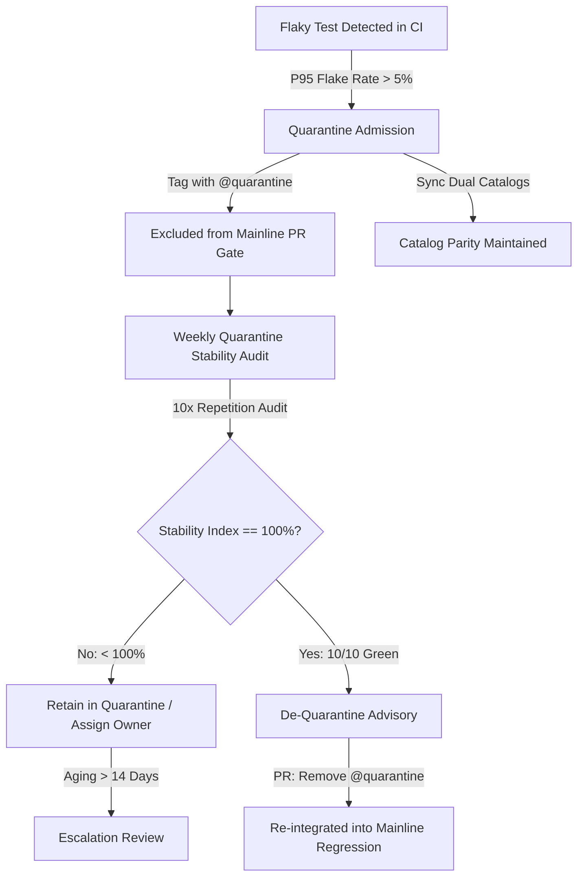

# BuggyBooks — Flaky Test Quarantine Lifecycle & Governance Manual

This document establishes the **authoritative engineering governance standard** for test quarantine, stability measurement, aging limits, and de-quarantine graduation within the `AutomationFrameworks` monorepo.

---

## 🧭 1. Executive Summary & Architecture

In large-scale multi-framework test automation suites, test flakiness (intermittent failures caused by network jitter, staging latency, timing races, or rendering delays) can poison CI pipelines and undermine team confidence. 

Rather than deleting failing tests or allowing flaky tests to intermittently block production pull requests, the `AutomationFrameworks` monorepo implements a **Closed-Loop Quarantine Governance Architecture**:



---

## 📋 2. Quarantine Admission Criteria

A test may only enter quarantine if it meets specific criteria and follows formal protocol.

### Allowed Admission Triggers
1. **Intermittent Flakiness**: The test fails intermittently ($\text{flake rate} > 5\%$) across $\ge 20$ recent CI runs on `main`.
2. **Documented Staging / Backend Bug**: A backend API or frontend defect has been reported to the development team (with tracking issue ID), and the test serves as a regression pin.
3. **Third-Party Infrastructure Degradation**: Upstream dependencies (e.g., mail server, external payment gateway simulation) are intermittently unresponsive.

### Prohibited Quarantine Misuse
Quarantine **MUST NOT** be used to bypass:
- ❌ **Deterministic PR Failures**: Code changes made in a pull request breaking test assertions.
- ❌ **Missing Render Staging Warm-Up**: Test failing because the pre-flight probe (`wait-on`) was omitted.
- ❌ **Multi-Browser Violations**: Test failing on non-Chrome browsers (violating the Google Chrome single-browser policy).
- ❌ **State Leakage**: Test failing because an earlier test altered chaos parameters without executing `POST /api/test/reset`.

---

## 🏷️ 3. Quarantine Tagging & Dual-Catalog Registration

When placing a test into quarantine, engineers must execute two atomic operations:

### Step 1: Add the `@quarantine` Tag in Code
Append `@quarantine` to the test spec title:

```typescript
// Before:
test('UI_CART_05: Cart persistence across session storage refresh @regression', async ({ page }) => { ... });

// After:
test('UI_CART_05: Cart persistence across session storage refresh @regression @quarantine', async ({ page }) => { ... });
```

### Step 2: Update Both Test Catalogs in Exact Parity
Update both `docs/test_cases_catalog.md` and `playwright-e2e/test_cases_catalog.md`:
1. Append `@quarantine` to the `Tags` column.
2. In the `Covered` column, append the quarantine tracking ticket: `<br>- Quarantine: Issue #<ID>`.
3. Verify byte-for-byte parity immediately:
   ```bash
   npm run test:verify-catalog
   ```

---

## ⏱️ 4. Quarantine Aging & SLA Limits

Quarantine is a **temporary hospital**, not a permanent graveyard. 

| Metric | Threshold | Action upon Exceeding |
| :--- | :--- | :--- |
| **Maximum Retention SLA** | 14 Calendar Days | Formal review by SDET Architect during sprint planning. |
| **Max Quarantine Audit Cycles** | 2 Weekly Cron Cycles | Automatic ping to assigned test owner. |
| **Max Quarantined Test Cap** | $\le 5$ tests repository-wide | Hard Quality Gate block on new test additions. |

---

## 🔄 5. Closed-Loop Quarantine Stability Audit Pipeline

### Workflow Overview (`.github/workflows/quarantine-audit.yml`)
- **Trigger**: Every Monday at 02:00 UTC (`cron: '0 2 * * 1'`) and on-demand via `workflow_dispatch`.
- **Execution Target**: Runs all specs tagged with `@quarantine` against BuggyBooks staging.
- **Repetition Factor**: Runs each quarantined test **10 times** (`--repeat-each=10`).
- **Environment**: Single-browser Google Chrome (`channel: 'chrome'`), pre-flight probe enforced, state reset enabled.

### Stability Index Formula
$$\text{Stability Index} = \left(\frac{\text{Passed Runs}}{\text{Total Runs} - \text{Skipped Runs}}\right) \times 100\%$$

### Step Summary & Actionable Recommendations
The workflow appends an executive stability table directly into `$GITHUB_STEP_SUMMARY`:

| Quarantined Test Title | Spec File | Runs | Passed | Failed | Stability Index | Recommendation |
| :--- | :--- | :---: | :---: | :---: | :---: | :--- |
| **UI_CART_05: Cart persistence** | `Checkout/Test_005.spec.ts` | `10` | `10` | `0` | `100.0%` | 🟢 **DE-QUARANTINE RECOMMENDED** (100% Pass Rate) |
| **API_CHAOS_03: Network latency** | `Chaos/Test_003.spec.ts` | `10` | `7` | `3` | `70.0%` | 🔴 **RETAIN IN QUARANTINE** (Flakiness: 30.0%) |

---

## 🎓 6. De-Quarantine Graduation Protocol

When a quarantined test achieves a **100.0% Stability Index** across 10 repetitions:

1. **Verification**: Confirm the underlying bug fix has deployed or locator stabilization is merged.
2. **Tag Removal**: Remove `@quarantine` from the spec title in `playwright-e2e/src/tests/`.
3. **Catalog Synchronization**: Remove `@quarantine` from `docs/test_cases_catalog.md` and synchronize:
   ```bash
   npm run test:verify-catalog -- --fix
   ```
4. **Local Smoke Check**: Validate clean execution:
   ```bash
   npm run test:smoke --workspace=playwright-e2e
   ```
5. **Pull Request**: Open a PR with conventional title:
   ```bash
   git commit -m "fix(test): de-quarantine UI_CART_05 after stabilization (10/10 green runs)"
   ```
6. **Re-integration**: Once merged, the test resumes active enforcement in `pr-gate.yml` and `playwright-ci.yml`.

---

## 🛠️ 7. CLI Quick Reference

```bash
# Run quarantine stability audit locally with 10 repetitions
npm run test:quarantine:audit

# Run quarantine audit with custom repetition count
REPEAT_EACH=15 npm run test:quarantine:audit

# Verify dual-catalog parity
npm run test:verify-catalog

# Automatically synchronize catalog if drift occurs
npm run test:verify-catalog -- --fix
```
