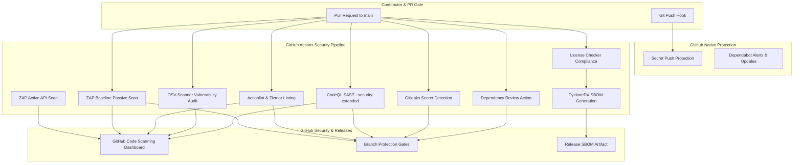

# BuggyBooks — Repository Security Controls & Supply-Chain Governance

This document outlines the security controls, static analysis, secret scanning, dependency governance, workflow security, license compliance, and branch protection policies enforced across the `AutomationFrameworks` monorepo.

---

## 🧭 Security Architecture & Zero-Trust Supply-Chain Baseline

In accordance with Sprint 6.3 specifications, all security tooling is **free, open-source (OSS), and GitHub-native**, operating under strict **least-privilege permissions (`permissions: {}` top-level default)** and immutable commit SHA action pinning (`uses: action@<commit-sha> # vX.Y.Z`).

---

## 🛡️ Security Controls & Policy Matrix

| Control Category | Security Tool | Configuration / Scope | Trigger Events | Blocking Gate | Persona Owner |
| :--- | :--- | :--- | :--- | :---: | :--- |
| **SAST (Static Code Analysis)** | GitHub CodeQL (`github/codeql-action`) | Language: `javascript-typescript`, Query suite: `security-extended` | PR, Push (`main`), Weekly Cron (`0 6 * * 1`) | **Yes** | SDET Architect |
| **Secret Scanning (History & Commits)** | Gitleaks (`gitleaks/gitleaks-action`) | `.gitleaks.toml` with strict allow-list for test fixtures (`fetch-depth: 0`) | PR, Push (`main`) | **Yes** | DevOps Engineer |
| **Secret Push Protection** | GitHub Secret Scanning | Pre-receive secret interceptor for API keys, tokens, and cloud credentials | `git push` | **Yes** (Native) | Product Owner (Admin) |
| **Automated Updates** | GitHub Dependabot | `.github/dependabot.yml` covering `npm` workspaces and `github-actions` (7-day cooldown, 5 PR max) | Weekly (Monday 06:00 UTC) | No (PR authoring) | DevOps Engineer |
| **Vulnerability Scanning** | Google OSV-Scanner (`google/osv-scanner-action`) | Scans `package-lock.json` against OSV database, uploads SARIF | PR, Push (`main`), Weekly Cron | **Yes** (High/Critical) | SDET Architect |
| **Dependency Review Gate** | Dependency Review (`actions/dependency-review-action`) | Blocks introduction of packages with High/Critical CVEs or unapproved licenses | PR to `main` | **Yes** | SDET Architect |
| **License Compliance** | `license-checker-rseidelsohn` | Evaluates monorepo workspace dependencies against approved OSS licenses | PR, Push (`main`), Weekly Cron | **Yes** | SDET Architect |
| **Software Bill of Materials (SBOM)** | Anchore Syft (`anchore/sbom-action`) | CycloneDX JSON format artifact generation for release lifecycle | PR, Push (`main`), Weekly Cron | **Yes** (Artifact Gate) | DevOps Engineer |
| **Workflow Syntax Linting** | Actionlint (`rhysd/actionlint`) | Validates GitHub Actions syntax, expression types, and runner properties | PR, Push (`main`) | **Yes** | DevOps Engineer |
| **Workflow Security Auditing** | Zizmor (`zizmorcore/zizmor`) | Static security analysis for Actions: template injection, credentials, least privilege | PR, Push (`main`) | **Yes** (Medium/High) | DevOps Engineer |
| **DAST (Passive Baseline Scan)** | OWASP ZAP (`zaproxy/action-baseline`) | Probes frontend SPA (`:5173`) with alpha rules, `security/zap-rules.tsv`, uploads SARIF (`zap-baseline`) | PR to `main`, Dispatch | **Yes** (FAIL rules) | Security Test Engineer |
| **DAST (Active API Penetration)** | OWASP ZAP (`zaproxy/action-api-scan`) | Active penetration scan against `docs/api/openapi.yaml` (`:4000`), excluding `/api/test/*`, SARIF (`zap-api`) | Nightly (`04:00 UTC`), Dispatch | **Yes** (Reporting Gate) | Security Test Engineer |

---

## 🔒 Branch Protection Required-Checks List

To guarantee that no code merges to `main` without satisfying the security baseline, the **Product Owner / Repository Admin** must configure GitHub branch protection rules on `main` requiring the following status checks:

### Required Checks for `main`:
1. `Static Quality & Linting` (from `PR Quality Gate` / `pr-gate.yml`)
2. `Smoke Tests (Chrome UI + API)` (from `PR Quality Gate` / `pr-gate.yml`)
3. `CodeQL Analysis (JavaScript / TypeScript)` (from `Security - CodeQL SAST` / `security-codeql.yml`)
4. `Gitleaks Secret Detection` (from `Security - Secret Scanning` / `security-secrets.yml`)
5. `Dependency Review (PR Gate)` (from `Security - Dependencies & SBOM` / `security-deps.yml`)
6. `Actionlint Workflow Linter` (from `Security - Workflow Linting` / `lint-workflows.yml`)
7. `Zizmor Workflow Security Audit` (from `Security - Workflow Linting` / `lint-workflows.yml`)
8. `ZAP Baseline Passive Scan (PR)` (from `Security - DAST` / `security-dast.yml`)

---

## 📋 Manual Repository Configuration Guide (Product Owner Step)

The following native repository security toggles require Product Owner / Admin privileges in the GitHub Web UI:

### 1. Enable Secret Scanning & Push Protection
1. Navigate to repository **Settings** $\rightarrow$ **Code security and analysis**.
2. Locate **Secret scanning**: Click **Enable**.
3. Under **Secret scanning**, locate **Push protection**: Click **Enable**.
   *(This prevents developers from accidentally pushing unredacted keys, AWS tokens, or service credentials).*

### 2. Enable Dependabot Security & Version Updates
1. Under **Code security and analysis**:
   - Ensure **Dependabot alerts** is set to **Enabled**.
   - Ensure **Dependabot security updates** is set to **Enabled**.
2. Repository automatically consumes `.github/dependabot.yml` on the scheduled weekly cadence.

### 3. Enforce Branch Protection Rules on `main`
1. Navigate to repository **Settings** $\rightarrow$ **Branches**.
2. Click **Add branch protection rule** (or edit rule for `main`):
   - **Branch name pattern**: `main`
   - Check **Require a pull request before merging**
     - Check **Require approvals** (Count: 1)
     - Check **Dismiss stale pull request approvals when new commits are pushed**
   - Check **Require status checks to pass before merging**
     - Check **Require branches to be up to date before merging**
     - Search and select the 7 required status checks listed in Section 3 above.
   - Check **Require conversation resolution before merging**
   - Check **Do not allow bypassing the above settings**
3. Click **Save changes**.

---

## ⚖️ Approved Open-Source License Register

The repository permits only approved, permissive open-source licenses for dependencies in production and test runners. Permitted licenses include:

| SPDX License Identifier | Classification | Description |
| :--- | :--- | :--- |
| `MIT` | Permissive | Standard permissive software license |
| `ISC` | Permissive | Functionally equivalent to two-clause BSD |
| `Apache-2.0` | Permissive | Permissive license with patent grant |
| `BSD-2-Clause` | Permissive | Simplified BSD License |
| `BSD-3-Clause` | Permissive | Modified BSD License |
| `0BSD` | Permissive | Zero-clause BSD (Public Domain equivalent) |
| `CC0-1.0` | Permissive | Creative Commons Zero Public Domain Dedication |
| `Python-2.0` | Permissive | Python Software Foundation License |
| `BlueOak-1.0.0` | Permissive | Modern permissive license |
| `Unlicense` | Permissive | Public domain dedication |
| `WTFPL` | Permissive | Permissive public license |
| `MPL-2.0` | Weak Copyleft | File-level copyleft; permitted specifically for `@axe-core/playwright` accessibility tooling |
| `CC-BY-3.0` / `CC-BY-4.0` | Attribution | Documentation and dataset license |
| `Zlib` | Permissive | Compression library permissive license |
| `LGPL-3.0-or-later` | Weak Copyleft | Dynamically linked binary (`@img/sharp-libvips-linux-x64`) consumed by `sharp` for test report image rendering |

Dual licenses combining these permissive options (e.g. `(MIT OR CC0-1.0)`, `(MIT OR GPL-3.0-or-later)`, `WTFPL OR ISC`) are accepted where the permissive grant applies to test runners.

---

## ⚠️ Accepted Risk & Security Triage Register

| Risk / Finding ID | Component | Vulnerability / Concern | Status | Rationale & Remediation Plan | Review Date |
| :--- | :--- | :--- | :---: | :--- | :--- |
| **AR-631-01** | `packages/playwright-utils/src/security/redact.test.ts` | Gitleaks flagged JWT token | `ACCEPTED` | RFC 7519 standard public example JWT used strictly as a test fixture to unit test `redactSecrets()` utility. Explicitly allow-listed in `.gitleaks.toml`. | 2026-10-05 |
| **AR-631-02** | `.env.example`, `jmeter/TestData/` | Test account passwords (`Password123!`, `password123`) | `ACCEPTED` | Public dummy credentials for test accounts against shared staging/sandbox environment. Real credentials injected exclusively via GitHub Secrets (`E2E_USER_NAME`, `E2E_PASSWORD`). | 2026-10-05 |
| **AR-632-01** | `mobile-automation` (Appium 2.x sub-dependencies) | Transitive advisories (`yaml`, `yauzl`, `path-to-regexp`, `ws`, `serialize-javascript`) | `TRIAGED` | Upgrading requires breaking changes (`appium@3.8.0`, `mocha@12.0.3`). Tracked in Dependabot grouped PRs. Handled non-blocking in `security-deps.yml` second opinion. | 2026-11-01 |
| **AR-632-02** | `@img/sharp-libvips-linux-x64` | `LGPL-3.0-or-later` binary package | `ACCEPTED` | Pre-built binary dependency used exclusively in CI Linux runners for Allure/Monocart chart image processing. Dynamically linked; no copyleft contagion to test framework source. | 2026-10-05 |
| **AR-633-01** | `@axe-core/playwright` | Mozilla Public License (`MPL-2.0`) | `ACCEPTED` | Industry standard accessibility testing engine owned by Deque Systems. MPL-2.0 is file-level copyleft and does not taint monorepo test frameworks. | 2026-10-05 |
| **AR-633-02** | Reusable Workflow Internal Delegation | Caller secrets passed explicitly | `RESOLVED` | Eliminated `secrets: inherit` across all workflows; callers explicitly map only `E2E_USER_NAME` and `E2E_PASSWORD`. | 2026-10-05 |

