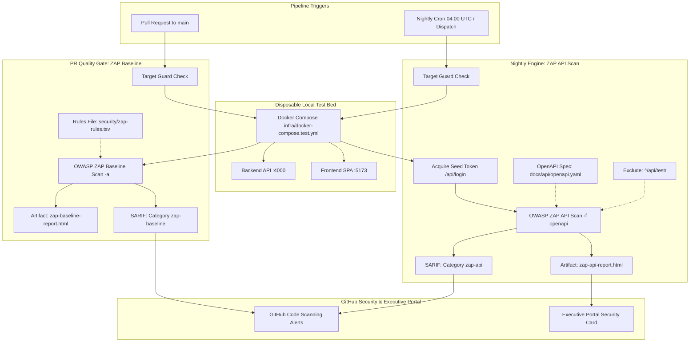

# BuggyBooks — Application Security & DAST Testing Guide

**Navigation**: [🗺️ Planning Hub](../../planning/README.md) | [Phase 9: Security Testing](../../planning/Phases/phase_9_security_testing_dast_and_appsec.md) | [Repository Security Controls](repo_security_controls.md)

This guide documents the Dynamic Application Security Testing (DAST) architecture, automated security scanning workflows, localhost scope guards, rules triage baselines, and vulnerability management procedures for the BuggyBooks application.

---

## 1. 🛡️ Non-Negotiable Localhost Scope Guard

> [!CAUTION]
> **STRICT SCOPE GUARD**: Active vulnerability scanning, injection fuzzing, and destructive attack payloads are **STRICTLY PROHIBITED** against shared staging environments (`https://buggy-books.onrender.com` or `https://buggy-books-fe.onrender.com`) or any external host.

- **Authorized Target**: Dynamic security scans and automated AppSec tests must **ONLY** target the ephemeral BuggyBooks instance (`http://localhost:4000` for backend API, `http://localhost:5173` for frontend SPA) managed via `infra/docker-compose.test.yml`.
- **Shared Staging Boundary**: Render staging is strictly reserved for non-intrusive functional regression and passive security checks (headers, cookies, CORS). Active scans against Render staging violate service terms and disrupt shared staging state.
- **Automated CI Enforcement**: All security workflows execute a pre-flight **Target Guard** step that verifies the target matches `^http://localhost(:[0-9]+)?(/.*)?$` before launching security tooling. Any deviation immediately aborts the job.

---

## 2. 🧭 Dynamic Application Security Testing (DAST) Architecture

DAST operates via two distinct, complementary automated scanning pipelines in `.github/workflows/security-dast.yml`:



### A. ZAP Passive Baseline Scan (`zap-baseline`)
- **Trigger**: Every pull request targeting `main`.
- **Scope**: Passive analysis of frontend responses (`http://localhost:5173`), probing for missing security headers, insecure cookies, anti-MIME-sniffing headers, and client-side misconfigurations.
- **Engine**: `zaproxy/action-baseline` running with `-a` (includes alpha passive scanning rules).
- **Rule Governance**: Governed by `security/zap-rules.tsv`. Unhandled warnings or true positives set to `FAIL` will break the PR gate.
- **Output**: SARIF upload under category `zap-baseline` + HTML report artifact.

### B. ZAP Active API Scan (`zap-api-scan`)
- **Trigger**: Scheduled nightly at 04:00 UTC and on manual `workflow_dispatch`.
- **Scope**: Active penetration and fuzzing against all routes defined in `docs/api/openapi.yaml`.
- **Authentication**: Seeded test credentials (`admin` / `password123`) acquire a JWT bearer token injected via Authorization header.
- **Strict Constraint**: **No bypass headers** (`x-bypass-rate-limit`, `x-bypass-csrf`) are injected into the scan context.
- **Chaos Protection**: Endpoints matching `^/api/test/` are explicitly excluded from scan targets to prevent unintended application resets or chaos parameter tampering.
- **Output**: SARIF upload under category `zap-api` + HTML report published to Executive Portal.

---

## 3. 📋 Rules Governance & Risk Acceptance (`security/zap-rules.tsv`)

ZAP rules are triaged through a tab-separated file (`security/zap-rules.tsv`) with the following format:

```tsv
# <Rule ID>	<Action>	<Comment / Justification / Review Date>
```

| Action | Meaning |
| :--- | :--- |
| **`FAIL`** | True positive security defect requiring immediate remediation; fails the workflow run. |
| **`WARN`** | Informational alert under monitoring; logs warning without failing build. |
| **`IGNORE`** | Documented accepted risk or intentional test design quirk; requires technical rationale and review date. |

### Documented Rule Overrides

| Rule ID | Action | Name | Justification & Review Date |
| :--- | :---: | :--- | :--- |
| `10015` | `WARN` | Re-examine Cache-Control Directives | Static assets served from container SPA; scheduled for cache header tuning. Review: 2026-11-01. |
| `10020` | `WARN` | Anti-clickjacking Header | `X-Frame-Options` header handled via upstream gateway/nginx. Review: 2026-11-01. |
| `10038` | `WARN` | Content Security Policy (CSP) Header Not Set | Development SPA build lacks strict CSP directives; tracked in Phase 10 visual/a11y hardening. Review: 2026-11-01. |
| `10096` | `WARN` | Timestamp Disclosure | Unix epoch timestamps returned in API inventory telemetry. Low sensitivity. Review: 2026-11-01. |
| `10054` | `WARN` | Cookie without SameSite Attribute | Test session cookies in local container environment. Review: 2026-11-01. |
| `10021` | `WARN` | X-Content-Type-Options Header Missing | Static files served without explicit nosniff in dev container. Review: 2026-11-01. |

---

## 4. 💻 Local Verification & Manual Scan Execution

To execute DAST scans locally against the ephemeral Docker stack:

### Step 1: Start the Ephemeral Environment
```bash
docker compose -f infra/docker-compose.test.yml up -d --wait
npx wait-on -t 60000 http://localhost:4000/api/books http://localhost:5173/
```

### Step 2: Execute ZAP Baseline Passive Scan
```bash
docker run --rm --network host \
  -v "$PWD/security:/zap/wrk:rw" \
  ghcr.io/zaproxy/zaproxy:stable \
  zap-baseline.py \
    -t http://localhost:5173 \
    -c zap-rules.tsv \
    -r zap-baseline.html \
    -J zap-baseline.json \
    -a
```

### Step 3: Execute ZAP Active API Scan
```bash
# Obtain authentication token
TOKEN=$(curl -s -X POST http://localhost:4000/api/login \
  -H "Content-Type: application/json" \
  -d '{"username":"admin","password":"password123"}' | jq -r '.token')

# Execute API scan with OpenAPI definition
docker run --rm --network host \
  -v "$PWD:/zap/wrk:rw" \
  ghcr.io/zaproxy/zaproxy:stable \
  zap-api-scan.py \
    -t /zap/wrk/docs/api/openapi.yaml \
    -f openapi \
    -r zap-api.html \
    -J zap-api.json \
    -z "-config replacer.full_list(0).description=auth -config replacer.full_list(0).enabled=true -config replacer.full_list(0).matchtype=REQ_HEADER -config replacer.full_list(0).matchstr=Authorization -config replacer.full_list(0).regex=false -config replacer.full_list(0).replacement='Bearer $TOKEN'"
```

### Step 4: Tear Down Ephemeral Containers
```bash
docker compose -f infra/docker-compose.test.yml down -v --remove-orphans
```

---

## 5. 🔬 Vulnerability Triage & Escalation Workflow

1. **Alert Ingestion**: When ZAP detects an alert, review the corresponding SARIF finding under GitHub **Security** $\rightarrow$ **Code scanning**.
2. **Reproducibility**: Reproduce the finding locally using `curl` or Playwright API tests against `http://localhost:4000` without bypass headers.
3. **Classification**:
   - **True Positive Bug**: Create an issue, flag in `security/zap-rules.tsv` as `FAIL`, and schedule remediation.
   - **Intentional Chaos/Bug**: Cross-reference against [`docs/intentional_bugs.md`](../intentional_bugs.md). If intentional, document in `zap-rules.tsv` with `IGNORE` or `WARN` and state justification.
   - **False Positive**: Downgrade rule in `security/zap-rules.tsv` to `IGNORE` with technical rationale and scheduled 30-day review date.

---

## 6. 🛡️ Application Security (AppSec) Automated Test Suite

In **Sprint 9.2**, the DAST pipeline is complemented with a comprehensive Playwright `@security` automated test suite consisting of 39 deterministic specifications in `playwright-e2e/src/tests/api/Security/` and `playwright-e2e/src/tests/ui/Security/`.

### A. Fixture Architecture: `securityApi`

Standard functional test specs utilize the `api` fixture, which automatically injects `x-bypass-rate-limit: true` and `x-bypass-csrf: true` to prevent test infrastructure bottlenecks.

For genuine penetration and security testing, the suite introduces the **`securityApi`** fixture defined in [`src/core/base/security.fixture.ts`](../../playwright-e2e/src/core/base/security.fixture.ts):
- **Zero Bypass Headers**: Strictly omits `x-bypass-rate-limit` and `x-bypass-csrf`.
- **Isolated Sessions**: Allocates an ephemeral `x-test-session-id` per worker and cleans it up during teardown.
- **Omit Bypass Client Flag**: Sets `omitBypassHeaders: true` on the `ApiClientHub` instance so underlying HTTP calls do not inject bypasses.

### B. OWASP Classification & Test Mapping

All tests carry the primary `@security` tag plus an industry-standard OWASP taxonomy tag:

| OWASP Category | Focus Area | Spec File | Test IDs |
| :--- | :--- | :--- | :--- |
| **API1:2023** | Broken Object Level Authorization (BOLA) | `Test_003_ObjectLevelAuthorization.spec.ts` | `SEC-AUTHZ-01` to `SEC-AUTHZ-04` |
| **API2:2023 / A07:2021** | Broken Authentication & Session Security | `Test_002_JwtAndSessionSecurity.spec.ts` | `SEC-AUTH-01` to `SEC-AUTH-07` |
| **API3:2023** | Broken Object Property Level Authorization (BOPLA) | `Test_003_ObjectLevelAuthorization.spec.ts` | `SEC-AUTHZ-05` |
| **API4:2023** | Unrestricted Resource Consumption | `Test_005_AvatarUploadSecurity.spec.ts`, `Test_008_BruteForceRateLimit.spec.ts` | `SEC-UPL-01`, `SEC-UPL-03`, `SEC-RL-01` |
| **API8:2023 / A05:2021** | Security Misconfiguration & Leakage | `Test_006_SecurityHeadersAndCors.spec.ts`, `Test_009_InformationLeakage.spec.ts` | `SEC-HDR-01` to `SEC-HDR-09`, `SEC-LEAK-01` to `SEC-LEAK-03` |
| **A01:2021** | Broken Access Control (CSRF) | `Test_007_CsrfEnforcement.spec.ts` | `SEC-CSRF-01` to `SEC-CSRF-03` |
| **A03:2021** | Injection & Cross-Site Scripting (XSS) | `Test_004_InjectionPayloads.spec.ts`, `ui/Security/Test_001_StoredXss.spec.ts` | `SEC-INJ-01` to `SEC-INJ-06` |

### C. Execution Commands

```bash
# Run full security test suite against ephemeral Docker environment
cross-env ENV=DOCKER npm run test:security

# List all discovered @security test cases
npx playwright test --grep "@security" --list --config=src/config/playwright.config.ts

# Execute specific AppSec test suite
cross-env ENV=DOCKER npx playwright test src/tests/api/Security/Test_002_JwtAndSessionSecurity.spec.ts --config=src/config/playwright.config.ts

# Run passive transport and security header checks against shared staging
cross-env ENV=STAGING npx playwright test src/tests/api/Security/Test_006_SecurityHeadersAndCors.spec.ts --config=src/config/playwright.config.ts
```

### D. Findings Triage & `test.fail()` Governance

When an automated security test uncovers an application vulnerability:
1. **Intentional Anti-Patterns**: If the defect is an intentional BuggyBooks training scenario, document it in [`docs/intentional_bugs.md`](../intentional_bugs.md) and annotate the spec with `test.fail(condition, 'AppSec Finding: <description>')`.
2. **Unintentional Product Vulnerabilities**: File a high-priority issue in `munna7862/buggy-books` and track remediation in the sprint backlog.

