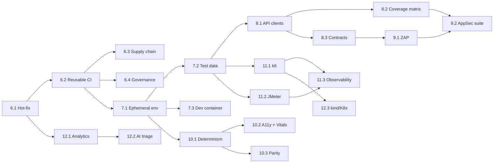

# AutomationFrameworks — Enhancement Roadmap v2 (Phases 6–12)

**Status**: Approved by PO 2026-10-05 — phase and sprint specs authored, implementation not started
**Baseline**: `main` @ `1de55ad` (Sprint 5.3 closed — all 15 sprints / 63 SP of the [Master Plan](master_plan.md) delivered)
**Author context**: Repository-wide review of all frameworks, CI workflows, perf suites, docs, and the BuggyBooks source (`../buggy-books`)
**Goal**: Move the monorepo from "broad multi-framework showcase" to a **production-grade quality-engineering platform** — trustworthy CI, hermetic environments, contract and security testing, real performance engineering with observability, and AI-assisted triage.

---

## 1. Executive Assessment

### 1.1 What is already strong

| Area | Evidence |
| :--- | :--- |
| Playwright core | 110 tests (55 API + 54 Chrome UI + 1 setup), fixture DI, `storageState` auth caching, session isolation via `x-test-session-id`, failure hooks, network capture |
| Breadth | Playwright, Selenium, WDIO, Appium, k6, JMeter all target the same app |
| Governance | Dual-catalog parity gate, quarantine lifecycle + weekly audit, PR gate, sprint and persona model |
| Reporting | Allure (per framework, namespaced on gh-pages), Monocart, portal landing page with KPI badges |
| Chaos engineering | Documented intentional bugs (`docs/intentional_bugs.md`) with recipes for each framework |
| AI enablement | Copilot agents, prompts, instructions, Playwright MCP config |

### 1.2 Maturity scorecard (today → target)

| Discipline | Today | Target | Biggest gap |
| :--- | :---: | :---: | :--- |
| CI/CD trustworthiness | 2 / 5 | 5 | Test failures do not fail the build (see §2) |
| Supply-chain & repo security | 1 / 5 | 4 | No CodeQL, secret scanning, Dependabot, SBOM, or workflow linting |
| Environment hermeticity | 1 / 5 | 4 | Every run hits one **shared** free-tier Render instance that chaos tests change for everyone |
| API testing depth | 3 / 5 | 5 | No schema/contract validation, raw `request` calls in specs, 4 endpoints untested |
| Security testing (DAST) | 0 / 5 | 4 | None |
| UI determinism | 3 / 5 | 5 | Hard waits in 6 specs; no front-end perf budgets |
| Cross-framework parity | 2 / 5 | 4 | Selenium and WDIO have only 2 specs each, no lint |
| Performance engineering | 3 / 5 | 5 | The "soak" lasts 40s; no server-side metrics correlation; drift gate runs on noisy free hosting |
| Observability & analytics | 2 / 5 | 4 | No flakiness index or failure classification; no Grafana |
| Cloud / containerisation | 2 / 5 | 4 | Docker only used as a Playwright runner image; no ephemeral envs |

---

## 2. Critical Findings — Fix First (P0)

These are defects in the current platform, not new features. Each one weakens confidence in every other result.

| # | Finding | Location | Impact | Fix |
| :-- | :--- | :--- | :--- | :--- |
| F1 | **CI reports green when tests fail.** Test steps use `continue-on-error: true` and nothing later fails the job | [playwright-ci.yml:73](../../.github/workflows/playwright-ci.yml), [selenium-ci.yml:75](../../.github/workflows/selenium-ci.yml), [wdio-ci.yml:75](../../.github/workflows/wdio-ci.yml), [mobile-ci.yml:74](../../.github/workflows/mobile-ci.yml) | Regressions ship silently; KPI badges are not trustworthy | Give the test step an `id`, keep report publishing on `if: always()`, add a final `Fail job if tests failed` step checking `steps.<id>.outcome` |
| F2 | **PR gate summary is hard-coded** ("ESLint: Passed", "100% verified") whatever the result | [pr-gate.yml](../../.github/workflows/pr-gate.yml) `Generate Static Quality Summary` | Misleading audit trail | Show the real step outcomes; publish test counts from `results.json` |
| F3 | **Fallback credentials in workflow** (`secrets.E2E_USER_NAME \|\| 'admin'`, `'password123'`) | [playwright-on-demand.yml:177](../../.github/workflows/playwright-on-demand.yml) | Credentials in source; silent fallback hides missing secrets | Remove the fallbacks; fail fast when a secret is missing |
| F4 | **No redaction in network or API logs.** `ApiUtil` logs full request and response bodies (passwords, JWTs); `NetworkInterceptor` has no masking | [api.util.ts](../../playwright-e2e/src/utils/api.util.ts), [network.interceptor.ts](../../playwright-e2e/src/core/network/network.interceptor.ts) | Secrets end up in Allure attachments and public gh-pages | Central `redact()` covering the `authorization`/`cookie` headers and `password`/`token`/`cardNumber` keys, used by the logger, the interceptor and Allure attachments |
| F5 | **`ApiUtil.makeRequest` swallows errors** and returns a fake success-shaped object | [api.util.ts](../../playwright-e2e/src/utils/api.util.ts) | Assertions can pass on failed setup calls | Throw a typed `ApiError`; allow non-2xx only through an explicit `expectStatus` option |
| F6 | **Shared-staging race.** Chaos and reset calls change one global server while PR gate, nightly mobile and on-demand runs can overlap | All staging workflows | Cross-run flakiness that looks like product bugs | Short term: a repo-wide `concurrency: buggybooks-staging` group for workflows that change state. Long term: Phase 7 hermetic envs |
| F7 | **Hard waits** (`new Promise(r => setTimeout(r, …))`) | A11y, JWT refresh, visual regression and token-refresh specs (6 places) | Slow and flaky; breaks the "zero blind timeouts" DoD | Replace with `expect.poll` or web-first assertions; add an ESLint ban |
| F8 | **Lockfile drift is hidden** by `npm ci \|\| npm install` | pr-gate, k6, mobile, selenium, wdio workflows | Builds that can't be reproduced | Use `npm ci` only |
| F9 | **Mixed toolchain versions** — Node 22 in pr-gate, 24 in playwright-ci; actions pinned by SHA in some files and by tag (`@v3`/`@v4`) in others | `.github/workflows/*` | Results differ by workflow | Add a root `.nvmrc` read via `node-version-file`, pin every action by SHA, let Dependabot keep them current |
| F10 | **Repo hygiene** | `packages/playwright-utils/dist/` committed; duplicate test data (`test-data/api/Test_001_BooksApi.json` vs `BookCatalog/…`, which differ); two `Logger.ts` in `mobile-automation/src/{core,utils}`; 2-line k6 shim files at the package root; `run-gemma4-e4b.bat` at the repo root; legacy `CRUDPerformanceTest.jmx` with 0 assertions | Various | Confusion and drift | Remove them or move them to `tools/`; build `dist` in CI |
| F11 | **README contradicts the policy** — the env table lists `firefox`/`edge`; prerequisites say Node 18 | [README.md](../../README.md) | Onboarding errors | Align with the Chrome-only policy and `.nvmrc` |

> **Recommended**: ship F1–F5 and F8 as the single hot-fix sprint **[Sprint 6.1](../Sprints/sprint_6_1_trustworthy_pipelines_hotfix.md)** before any feature work.

---

## 3. Decisions Log (PO, 2026-10-05)

| # | Decision | Effect on the roadmap |
| :-- | :--- | :--- |
| D1 | **No Azure subscription.** Use free alternatives only | Phase 12.3 is a free cloud-native platform: **kind + Helm + Kubernetes Indexed Jobs + k6-operator** inside GitHub Actions. GitHub Environments secrets replace Key Vault; k6-operator and distributed JMeter replace Azure Load Testing |
| D2 | **Publishing BuggyBooks images to GHCR is approved** (own repo) | Sprint 7.1 adds `publish-images.yml` in `munna7862/buggy-books`; every PR in this repo runs against a disposable BuggyBooks |
| D3 | **Prefer Google Chrome** everywhere | Dev container, Lighthouse (`chromePath`), k6 browser (`K6_BROWSER_EXECUTABLE_PATH`), Selenium Grid (`standalone-chrome`) and the K8s test-runner image all use Google Chrome. Viewport variation is allowed **inside** the existing `chrome` project; still exactly 3 Playwright projects |
| D4 | Personal repo; resume alignment is out of scope here | The resume-mapping section from the first draft was removed. Work-repo (`plan-sop-ui-automation`) review is a separate activity |
| D5 | Implementation by Antigravity agents; code review by Claude | Every sprint file has a **Code Review Checklist** section for the review gate |
| D6 | Free LLM inference only | Sprint 12.2 uses **GitHub Models** (free, rate-limited) in CI and local **Ollama** (`gemma4:e4b`) in dev, with a `none` fallback |

---

## 4. Roadmap Overview (Phases 6–12 · 21 Sprints · 95 SP)

| Phase | Theme | Priority | Sprints | SP |
| :--- | :--- | :---: | :--- | :---: |
| **[6](../Phases/phase_6_cicd_integrity_and_supply_chain_security.md)** | CI/CD Integrity & Supply-Chain Security | P0/P1 | [6.1](../Sprints/sprint_6_1_trustworthy_pipelines_hotfix.md) · [6.2](../Sprints/sprint_6_2_reusable_workflows_and_composite_actions.md) · [6.3](../Sprints/sprint_6_3_supply_chain_and_repository_security.md) · [6.4](../Sprints/sprint_6_4_repository_governance_and_contributor_experience.md) | 16 |
| **[7](../Phases/phase_7_hermetic_environments_test_data_and_developer_experience.md)** | Hermetic Environments, Test Data & DX | P1 | [7.1](../Sprints/sprint_7_1_ephemeral_buggybooks_environment_in_ci.md) · [7.2](../Sprints/sprint_7_2_test_data_engineering_and_typed_configuration.md) · [7.3](../Sprints/sprint_7_3_dev_container_and_local_developer_experience.md) | 14 |
| **[8](../Phases/phase_8_api_depth_typed_clients_schemas_and_contracts.md)** | API Depth: Typed Clients, Schemas & Contracts | P1/P2 | [8.1](../Sprints/sprint_8_1_typed_api_client_layer_and_schema_validation.md) · [8.2](../Sprints/sprint_8_2_api_coverage_gaps_and_negative_matrix.md) · [8.3](../Sprints/sprint_8_3_openapi_specification_and_contract_testing.md) | 14 |
| **[9](../Phases/phase_9_security_testing_dast_and_appsec.md)** | Security Testing (DAST + AppSec) | P2 | [9.1](../Sprints/sprint_9_1_dast_pipeline_with_owasp_zap.md) · [9.2](../Sprints/sprint_9_2_appsec_security_test_suite.md) | 10 |
| **[10](../Phases/phase_10_ui_quality_web_vitals_and_framework_parity.md)** | UI Quality, A11y, Web Vitals & Framework Parity | P2 | [10.1](../Sprints/sprint_10_1_ui_determinism_and_lint_enforcement.md) · [10.2](../Sprints/sprint_10_2_accessibility_web_vitals_and_visual_hardening.md) · [10.3](../Sprints/sprint_10_3_selenium_and_wdio_parity_expansion.md) | 13 |
| **[11](../Phases/phase_11_performance_engineering_and_observability.md)** | Performance Engineering & Observability | P2 | [11.1](../Sprints/sprint_11_1_k6_performance_maturity.md) · [11.2](../Sprints/sprint_11_2_jmeter_engineering_and_taurus_gating.md) · [11.3](../Sprints/sprint_11_3_observability_stack_and_performance_reporting.md) | 15 |
| **[12](../Phases/phase_12_intelligent_qualityops_and_free_cloud_native_platform.md)** | Intelligent QualityOps & Free Cloud-Native Platform | P3 | [12.1](../Sprints/sprint_12_1_test_analytics_and_failure_intelligence.md) · [12.2](../Sprints/sprint_12_2_ai_assisted_triage_and_self_healing_loop.md) · [12.3](../Sprints/sprint_12_3_free_cloud_native_execution_platform.md) | 13 |
| | **Total** | | **21 sprints** | **95 SP** |

Detailed scope, user stories (`US-AF-6xx` … `US-AF-12xx`), verification commands, review checklists and DoD live in the linked phase and sprint files. This document holds only the assessment, decisions and sequencing.

### 4.1 Critical-finding → sprint mapping

| Finding | Sprint |
| :--- | :--- |
| F1 false-green CI, F2 hard-coded summary, F3 fallback creds, F4 redaction, F5 `ApiError`, F6 staging race (short term), F8 `npm ci` | **6.1** |
| F9 toolchain / pinning | 6.2 |
| F10 hygiene, F11 README | 6.4 |
| F6 staging race (long term) | 7.1 |
| F7 hard waits | 10.1 |

---

## 5. Dependency Graph & Suggested Order

**Suggested execution order** (one sprint at a time with the Antigravity persona team; Claude reviews each PR):
`6.1 → 6.2 → 7.1 → 6.3 → 6.4 → 7.2 → 8.1 → 10.1 → 8.2 → 7.3 → 8.3 → 9.1 → 9.2 → 10.2 → 10.3 → 11.1 → 11.2 → 11.3 → 12.1 → 12.2 → 12.3`

Rationale: trustworthy CI first, then the disposable environment (it de-risks everything after it), then API rigour and determinism before adding security, perf and AI layers.

---

## 6. Optional Expansions (Backlog — pick by interest)

| Idea | Value | Notes |
| :--- | :--- | :--- |
| `api-java-restassured/` module (Java 17 + RestAssured + TestNG + Allure, Maven) | Adds a JVM stack to the comparison | Mirror 15–20 Playwright API tests; separate CI job |
| Unit tests for shared packages (`playwright-utils`, `test-data`) with coverage gate ≥ 80% | The framework code itself becomes tested | Vitest or `node:test` |
| Mutation testing (Stryker) on the `buggy-books` backend | Measures suite effectiveness, not just coverage | Nightly, app repo |
| E2E code coverage of the app (istanbul-instrumented frontend image + Monocart coverage) | Shows which UI code paths E2E exercises | Needs an instrumented image tag from `buggy-books` |
| Mobile: AVD snapshot caching, deep links, app start-time metric, mobile visual tests | Faster, richer mobile CI | Nightly, cost-aware |
| Docs site (MkDocs Material) + ADRs (`docs/adr/0001-chrome-only.md` …) | Easier navigation than many large markdown files | Deploy under `/docs` on gh-pages |
| Chaos-as-code (`chaos/*.yaml` scenarios applied by a fixture) | Reusable chaos experiments across frameworks | Extends `/api/test/config` |
| Synthetic monitoring (5-minute Playwright checks against Render) + uptime badge | Production-style monitoring | Cheap; reuses smoke specs |
| Self-hosted Pact Broker (docker) | Versioned contracts, can-i-deploy | Upgrade path from 8.3's file-based pacts |

---

## 7. Definition of Done (applies to every sprint in Roadmap v2)

1. `npm run lint:all` and `npm run typecheck:all` exit 0 — from Sprint 6.4 onward this **includes selenium-e2e and wdio-e2e**.
2. New or changed tests: 100% green on `--repeat-each=5` (or the framework equivalent) against the DOCKER env once Sprint 7.1 lands (STAGING before that).
3. Both catalogs updated in lockstep; `npm run test:verify-catalog` passes.
4. No secrets in logs or attachments (redaction unit test passes, from 6.1 onward).
5. CI fails on test failure (no ungated `continue-on-error` on test steps).
6. Google Chrome only; still exactly 3 Playwright projects.
7. Docs updated with relative links only (AGENTS.md §8).
8. PR description includes 📌 Summary of Changes and 🧪 Verification with real command output.
9. The sprint's **Code Review Checklist** is answered in the PR (Claude review gate) before the PO merges.

---

## 8. How to Run a Sprint (Antigravity + Claude review)

1. PO: "Execute Sprint X.Y" → the Antigravity Scrum Master persona follows AGENTS.md §10 using `planning/Sprints/sprint_X_Y_*.md`.
2. Antigravity implements, runs the sprint's **Verification Commands**, and opens the PR.
3. Claude reviews the PR against the sprint's **Code Review Checklist** and Definition of Done, then reports findings.
4. Antigravity addresses findings; PO merges; the sprint status in `planning/README.md` changes to `Done`.
