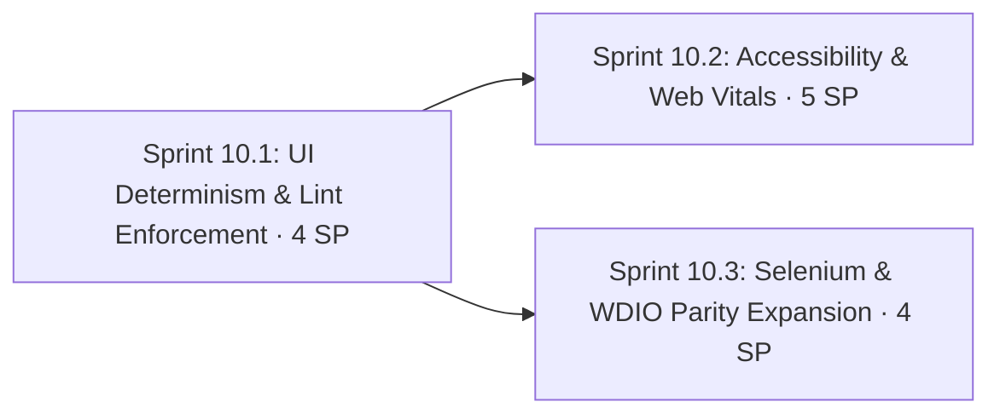

# Phase 10: UI Quality — Determinism, Accessibility, Web Vitals & Framework Parity

**Navigation**: [🗺️ Planning Hub](../README.md) | [📖 Roadmap v2](../Master/enhancement_roadmap_v2.md) | [⬅️ Phase 9](phase_9_security_testing_dast_and_appsec.md) | **[Phase 10]** | [Phase 11 ➡️](phase_11_performance_engineering_and_observability.md)

**Phase Identifier**: `PHASE-10-UI-QUALITY-WEB-VITALS-PARITY`
**Phase Status**: Not Started
**Priority**: P2 / Should
**Total Phase Velocity**: **13 Story Points** (Sprint 10.1: 4 SP, Sprint 10.2: 5 SP, Sprint 10.3: 4 SP)
**Phase Leads**: Playwright QA Lead & SDET Architect
**Primary Personas**: Playwright QA Lead, Selenium Specialist, SDET Architect, DevOps Engineer

---

## 1. Executive Summary & Phase Theme

The 54 Chrome UI tests are strong, but the review found:
- **6 hard waits** (`new Promise(r => setTimeout(r, …))`) in `Test_007_A11yScanValidation` (×2), `Test_006_JwtRefreshValidation`, `Test_010_VisualRegressionChaos` (×2) and API `Test_002_TokenRefreshAndProfileApi`. This breaks the "zero blind timeouts" DoD.
- There's no lint rule that prevents hard waits, raw locators in specs, or `force: true`.
- Accessibility scanning is limited to 4 tests; there are no keyboard-only journeys.
- **No front-end performance signal** (Core Web Vitals) in UI tests.
- Visual baselines exist for both `win32` and `linux`, so they depend on where they were captured.
- No burn-in for new or changed specs; flaky tests are found only after merging.
- Selenium (2 specs, 5 tests) and WDIO (2 specs, 5 tests) are far behind Playwright, so the cross-framework comparison isn't like-for-like.

**Phase 10** makes UI tests deterministic by construction, adds accessibility and Web Vitals quality gates (all in **Google Chrome**), and brings Selenium and WDIO up to a critical-journey parity set.

---

## 2. Architectural Scope & Target Outcomes

| Workstream | Current State | Phase Target Outcome |
| :--- | :--- | :--- |
| **Hard waits** | 6 occurrences | 0, with an ESLint ban |
| **Locator hygiene** | Mixed | Locators only in POMs; `getByRole`/`getByTestId` preferred; lint guard |
| **Flake prevention** | After merge (quarantine audit) | PR burn-in: `--only-changed --repeat-each=5` |
| **Deterministic edge states** | Live backend only | HAR/route mocks for empty, error and slow states |
| **Accessibility** | 4 axe tests | Every page and key state, WCAG 2.2 AA, keyboard journeys, trend on portal |
| **Web performance** | None | Web Vitals fixture (LCP, CLS, INP, TTFB) with budgets; Lighthouse CI on DOCKER (Chrome) |
| **Responsive (Chrome-only)** | Single 1280×720 viewport | Optional viewport matrix **inside the `chrome` project** (no new projects) |
| **Visual** | Baselines per OS | Linux-only baselines generated in the pinned Playwright image; masks; component snapshots |
| **Parity** | 5 / 5 / 54 tests | ~12 critical-journey tests in each of Selenium and WDIO |

---

## 3. Sprints in this Phase

1. **[Sprint 10.1: UI Determinism & Lint Enforcement](../Sprints/sprint_10_1_ui_determinism_and_lint_enforcement.md)** — 4 SP
2. **[Sprint 10.2: Accessibility, Web Vitals & Visual Hardening](../Sprints/sprint_10_2_accessibility_web_vitals_and_visual_hardening.md)** — 5 SP
3. **[Sprint 10.3: Selenium & WebdriverIO Parity Expansion](../Sprints/sprint_10_3_selenium_and_wdio_parity_expansion.md)** — 4 SP

---

## 4. Definition of Done & Quality Acceptance Gates

- [ ] `grep -rnE "setTimeout\(r|waitForTimeout" playwright-e2e/src/tests` returns nothing; ESLint enforces it.
- [ ] PR gate burn-in job runs changed specs 5× and fails on any flaky result.
- [ ] axe scans cover every routed page; 0 critical/serious violations, or each one documented as an intentional bug.
- [ ] Web Vitals budgets asserted for catalog, book detail, cart and checkout on DOCKER.
- [ ] Visual baselines exist for **linux only**, generated inside `mcr.microsoft.com/playwright:v1.58.0-jammy`.
- [ ] Selenium and WDIO each have ≥ 12 tests covering the parity set; `framework_comparison_benchmark.md` refreshed with like-for-like numbers.
- [ ] Single-browser policy preserved: Google Chrome only, still exactly 3 Playwright projects.

---

## 5. Risks, Gotchas & Mitigation Strategies

| Threat / Gotcha | Impact | Mitigation |
| :--- | :--- | :--- |
| Removing hard waits in chaos/visual tests exposes real timing issues | Temporary failures | Replace with `expect.poll` / `toPass` on the actual condition (e.g. layout stable, token refreshed) |
| Web Vitals are noisy on shared CI runners | Flaky budgets | Assert on the median of 3 navigations; generous budgets on CI, strict locally; DOCKER env only |
| Lighthouse overlaps `buggy-books` CI (it already has a `lighthouse-ci` job) | Duplicate effort | Keep Lighthouse here as **cross-check from the test platform** with user-journey URLs (authenticated cart/checkout), not just the landing page |
| Adding viewports could look like "multi-browser" | Policy confusion | Viewports are `test.use({ viewport })` within the `chrome` project; AGENTS.md §1 clarified |
| Selenium/WDIO parity adds CI time | Slower nightly | Run parity suites nightly, smoke-only on PR |
