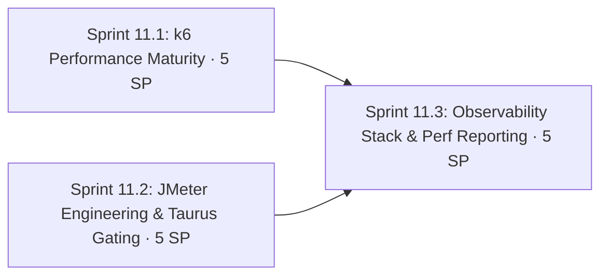

# Phase 11: Performance Engineering & Observability

**Navigation**: [🗺️ Planning Hub](../README.md) | [📖 Roadmap v2](../Master/enhancement_roadmap_v2.md) | [⬅️ Phase 10](phase_10_ui_quality_web_vitals_and_framework_parity.md) | **[Phase 11]** | [Phase 12 ➡️](phase_12_intelligent_qualityops_and_free_cloud_native_platform.md)

**Phase Identifier**: `PHASE-11-PERFORMANCE-ENGINEERING-OBSERVABILITY`
**Phase Status**: Not Started
**Priority**: P2 / Should
**Total Phase Velocity**: **15 Story Points** (Sprint 11.1: 5 SP, Sprint 11.2: 5 SP, Sprint 11.3: 5 SP)
**Phase Leads**: Performance Engineer & DevOps Engineer
**Primary Personas**: Performance Engineer, DevOps Engineer, SDET Architect

---

## 1. Executive Summary & Phase Theme

The dual-engine strategy (k6 for PR drift gates, JMeter for enterprise plans) is in place, but:
- The k6 **"soak" profile lasts 40 seconds** (5s ramp + 30s steady + 5s down) — that's a smoke test, not endurance.
- All topologies use closed-model VU stages; there are no open-model (arrival-rate) scenarios for throughput SLAs.
- The PR drift gate (±20%) measures against **free-tier Render**, where network and cold-start variance can exceed the threshold by itself.
- JMeter is **report-only**: no pass/fail gating in CI, plans aren't modular (login/browse/cart logic duplicated across 4 JMX files), and the legacy `CRUDPerformanceTest.jmx` has 0 assertions.
- **No server-side correlation**: client latency is never lined up against backend metrics (BuggyBooks exposes a JSON diagnostics payload at `GET /api/metrics`).
- No dashboards: results live in HTML files and `perf-history.json`.

**Phase 11** moves load to the disposable DOCKER env, adds real endurance and open-model scenarios, turns JMeter into a gated CI citizen through Taurus, and builds a **free, self-hosted observability stack** (Prometheus + Grafana + InfluxDB) that correlates client and server metrics.

> **Fair use rule**: sustained load, soak, stress, spike and breakpoint tests target **DOCKER only**. Render staging receives at most a ≤ 5 VU smoke.

---

## 2. Architectural Scope & Target Outcomes

| Workstream | Current State | Phase Target Outcome |
| :--- | :--- | :--- |
| **k6 workload models** | Closed VU stages | Closed + open (`constant-arrival-rate`, `ramping-arrival-rate`) scenarios |
| **Endurance** | 40s "soak" | 60–120 min soak, weekly on DOCKER, with memory/handle trend from `/api/metrics` |
| **Drift baselines** | Render-measured, noisy | DOCKER-measured baselines on a fixed runner class; Render informational only |
| **Browser + protocol hybrid** | None | k6 browser module driving **Google Chrome** (`K6_BROWSER_EXECUTABLE_PATH`) alongside protocol load |
| **JMeter structure** | 4 monolithic JMX files | Test Fragments + Module Controllers, `-J` property-driven, per-env CSV |
| **JMeter gating** | Report only | Taurus (`bzt`) pass/fail criteria → CI exit code |
| **Scale-out** | Single JMeter process | Distributed JMeter (controller + 2 workers) in docker compose |
| **Observability** | None | Prometheus + Grafana + InfluxDB; k6 remote-write; JMeter Backend Listener; backend metrics scraped |
| **Reporting** | HTML per run | k6 web-dashboard HTML export on portal + Grafana dashboards-as-code + SLO doc |

---

## 3. Sprints in this Phase

1. **[Sprint 11.1: k6 Performance Maturity](../Sprints/sprint_11_1_k6_performance_maturity.md)** — 5 SP
2. **[Sprint 11.2: JMeter Engineering & Taurus Gating](../Sprints/sprint_11_2_jmeter_engineering_and_taurus_gating.md)** — 5 SP
3. **[Sprint 11.3: Observability Stack & Performance Reporting](../Sprints/sprint_11_3_observability_stack_and_performance_reporting.md)** — 5 SP

---

## 4. Definition of Done & Quality Acceptance Gates

- [ ] k6 PR drift gate runs against DOCKER with recalibrated baselines; ≥ 5 consecutive green runs on `main` without code changes (noise check).
- [ ] Weekly soak (≥ 60 min) runs on DOCKER and publishes a report with a memory trend.
- [ ] At least 2 open-model k6 scenarios with throughput thresholds.
- [ ] k6 browser hybrid scenario runs with Google Chrome.
- [ ] All 4 BuggyBooks JMX plans use shared fragments and run under Taurus with pass/fail criteria; CI fails on SLA breach.
- [ ] `infra/observability/docker-compose.yml` brings up Prometheus, Grafana and InfluxDB with provisioned dashboards showing k6 + JMeter + backend metrics on one timeline.
- [ ] `docs/performance/slo_and_capacity_model.md` published.

---

## 5. Risks, Gotchas & Mitigation Strategies

| Threat / Gotcha | Impact | Mitigation |
| :--- | :--- | :--- |
| GitHub-hosted runners vary in CPU | Drift false positives even on DOCKER | Load generator and SUT on the same runner; compare p95 ratios; 3-run median baselines; widen to ±25% if noise proves it |
| 60–120 min soak consumes Actions minutes | Quota | Weekly schedule only; public repos get free standard-runner minutes; keep the soak at 60 min by default |
| `/api/metrics` is JSON, not Prometheus format | Can't scrape directly | Preferred: add `prom-client` `/api/metrics/prometheus` in `buggy-books` (our repo). Fallback: `prometheus-community/json-exporter` mapping the JSON fields |
| k6 browser module defaults to Chromium | Policy deviation | Set `K6_BROWSER_EXECUTABLE_PATH` to the Google Chrome binary on runner and dev container |
| Taurus + JMeter plugins download at runtime | Slow or flaky CI | Cache `~/.bzt` and the JMeter home; pin versions |
| `buggy-books` already has `perf-endurance.yml` | Duplicate effort | This repo owns cross-tool **test-platform** perf; link to (don't duplicate) the app repo's endurance workflow in the SLO doc |
