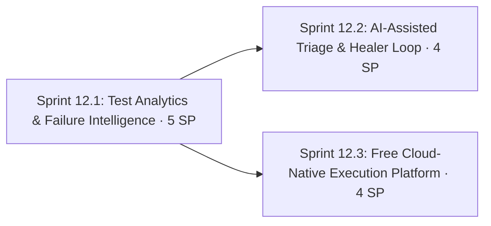

# Phase 12: Intelligent QualityOps & Free Cloud-Native Platform

**Navigation**: [🗺️ Planning Hub](../README.md) | [📖 Roadmap v2](../Master/enhancement_roadmap_v2.md) | [⬅️ Phase 11](phase_11_performance_engineering_and_observability.md) | **[Phase 12]**

**Phase Identifier**: `PHASE-12-INTELLIGENT-QUALITYOPS-CLOUD-NATIVE`
**Phase Status**: Not Started
**Priority**: P3 / Could
**Total Phase Velocity**: **13 Story Points** (Sprint 12.1: 5 SP, Sprint 12.2: 4 SP, Sprint 12.3: 4 SP)
**Phase Leads**: SDET Architect & DevOps Engineer
**Primary Personas**: SDET Architect, DevOps Engineer, Playwright QA Lead, Performance Engineer

---

## 1. Executive Summary & Phase Theme

With trustworthy signals (Phase 6), hermetic environments (Phase 7) and deep coverage (Phases 8–11), the platform can now **learn from its own history** and show **cloud-native execution patterns** — using only free tooling:

1. **Test analytics**: a normalised results history, flakiness index, failure classification and PR result comments.
2. **AI-assisted triage**: an LLM summarises failures (error, trace, DOM, redacted network log) into a root-cause hypothesis. A human-in-the-loop healer workflow opens **draft** PRs. Free providers: **GitHub Models** (free, rate-limited inference through `GITHUB_TOKEN` with `models: read`) in CI, and local **Ollama** (`tools/ai/run-gemma4-e4b.bat`) for development.
3. **Cloud-native without a cloud bill**: Kubernetes-in-Docker (**kind**) inside GitHub Actions, a **Helm chart** for BuggyBooks (GHCR images), **Playwright shards as a Kubernetes Indexed Job**, and **k6-operator** distributed load. This replaces the Azure items from the original roadmap draft (no Azure subscription).

---

## 2. Architectural Scope & Target Outcomes

| Workstream | Current State | Phase Target Outcome |
| :--- | :--- | :--- |
| **Results history** | Allure history per framework only | Normalised `results-history` dataset (JSON on gh-pages) across frameworks |
| **Flakiness** | Weekly quarantine audit | Per-test flakiness index, auto-suggested quarantine candidates |
| **Failure classification** | Manual | Allure `categories.json` + signature rules: product / environment / test / intentional |
| **PR feedback** | Step Summary only | Sticky PR comment: results, new failures vs main, report links |
| **Triage** | Manual reading of traces | LLM root-cause hypothesis in Step Summary (redacted inputs) |
| **Self-healing** | Copilot healer agent used ad hoc | `healer.yml` dispatch → draft PR with a proposed locator/wait fix, human-reviewed |
| **Cloud-native** | Docker compose only | kind cluster + Helm chart + K8s Job sharding + k6-operator, all inside free Actions runners |

---

## 3. Sprints in this Phase

1. **[Sprint 12.1: Test Analytics & Failure Intelligence](../Sprints/sprint_12_1_test_analytics_and_failure_intelligence.md)** — 5 SP
2. **[Sprint 12.2: AI-Assisted Triage & Self-Healing Loop](../Sprints/sprint_12_2_ai_assisted_triage_and_self_healing_loop.md)** — 4 SP
3. **[Sprint 12.3: Free Cloud-Native Execution Platform (kind + Helm + k6-operator)](../Sprints/sprint_12_3_free_cloud_native_execution_platform.md)** — 4 SP

---

## 4. Definition of Done & Quality Acceptance Gates

- [ ] Every CI run appends normalised results to the history dataset; the portal shows flakiness index, pass-rate trend, MTTR and slowest tests.
- [ ] Failures are auto-classified into 4 categories in Allure and in the PR comment.
- [ ] A failed run produces an AI triage summary using **only redacted** inputs; the provider is pluggable (GitHub Models / Ollama / none).
- [ ] `healer.yml` produces a draft PR for a seeded locator break; it's never auto-merged.
- [ ] `k8s-e2e.yml` creates a kind cluster, deploys BuggyBooks via Helm, runs Playwright as a 4-way Indexed Job and a k6-operator TestRun, and collects results.

---

## 5. Risks, Gotchas & Mitigation Strategies

| Threat / Gotcha | Impact | Mitigation |
| :--- | :--- | :--- |
| Sending logs to an LLM leaks secrets | Credential exposure | Only `redact()`-processed inputs (Sprint 6.1); truncate payloads; no cookies, storage state or `.env` |
| GitHub Models free tier rate limits / availability changes | Triage step fails | Triage step is `continue-on-error` **by design** (informational); provider `none` fallback; local Ollama path documented |
| LLM hallucinated fixes | Bad code merged | Draft PRs only, mandatory human review, healer output must pass lint + `--repeat-each=5` |
| kind on Actions runners is resource-constrained | Slow or OOM | 1 control-plane node, small resource requests, 4 shards max; run nightly or on dispatch, not per PR |
| Results history grows unbounded on gh-pages | Pages size limits | Keep 90 days of raw data, plus rolled-up monthly aggregates |
