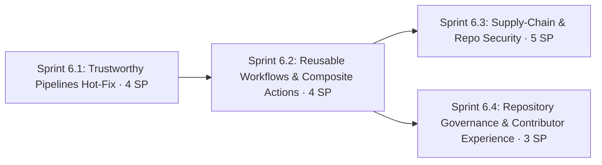

# Phase 6: CI/CD Integrity & Supply-Chain Security

**Navigation**: [🗺️ Planning Hub](../README.md) | [📖 Roadmap v2](../Master/enhancement_roadmap_v2.md) | [⬅️ Phase 5](phase_5_executive_observability_and_unified_allure_dashboard.md) | **[Phase 6]** | [Phase 7 ➡️](phase_7_hermetic_environments_test_data_and_developer_experience.md)

**Phase Identifier**: `PHASE-6-CICD-INTEGRITY-AND-SUPPLY-CHAIN-SECURITY`
**Phase Status**: In Progress (Sprint 6.1 Complete, 4/16 SP)
**Priority**: P0 / Must
**Total Phase Velocity**: **16 Story Points** (Sprint 6.1: 4 SP, Sprint 6.2: 4 SP, Sprint 6.3: 5 SP, Sprint 6.4: 3 SP)
**Phase Leads**: DevOps Engineer & SDET Architect
**Primary Personas**: DevOps Engineer, SDET Architect, Playwright QA Lead

---

## 1. Executive Summary & Phase Theme

Phases 1–5 built a broad multi-framework platform. A repository-wide review found that **CI results can't be fully trusted yet**:

1. Four workflows (`playwright-ci`, `selenium-ci`, `wdio-ci`, `mobile-ci`) run tests with `continue-on-error: true` and never fail the job afterwards. Test failures produce **green builds**, and the KPI badges on the portal can show success over real failures.
2. The PR gate summary prints hard-coded success text ("ESLint: Passed", "100% verified") whatever actually happened.
3. `playwright-on-demand.yml` falls back to hard-coded credentials (`'admin'` / `'password123'`) when secrets are missing.
4. `ApiUtil` and `NetworkInterceptor` log full request and response bodies (passwords, JWTs) with **no redaction**, and those logs flow into Allure attachments published to public GitHub Pages.
5. `ApiUtil.makeRequest` swallows errors and returns a success-shaped object.
6. The warm-up probe and chaos-reset shell blocks are copy-pasted into about 8 workflows; the three Playwright workflows together exceed 1,100 lines.
7. There is no SAST, secret scanning, dependency scanning, Dependabot, SBOM, or workflow linting. Actions are pinned by SHA in some files and by tag in others; Node versions differ (22 vs 24); `npm ci || npm install` hides lockfile drift.

**Phase 6** makes every signal trustworthy, removes CI duplication, and adds free supply-chain security controls.

---

## 2. Architectural Scope & Target Outcomes

| Workstream | Current State / Defect | Phase Target Outcome |
| :--- | :--- | :--- |
| **Test outcome gating** | `continue-on-error` hides failures | Reports always publish, **and** the job fails when any test fails |
| **Step summaries** | Hard-coded "Passed" text | Summaries generated from real `results.json` / step outcomes |
| **Secrets hygiene** | Fallback creds in YAML; unredacted logs | No secrets in YAML; central `redact()` used by every logger and attachment |
| **API utility semantics** | Errors swallowed | Typed `ApiError` thrown; explicit opt-in for expected non-2xx |
| **Workflow architecture** | ~8 copy-pasted blocks, 3 overlapping Playwright workflows | Composite actions + a reusable `workflow_call` E2E pipeline + nightly schedule |
| **Supply chain** | No scanners | CodeQL, gitleaks, osv-scanner/npm audit, Dependabot, actionlint + zizmor, SBOM |
| **Toolchain consistency** | Node 22/24 mix, mixed pinning | `.nvmrc` (Node 24 LTS) everywhere; all actions SHA-pinned |
| **Contributor governance** | No CODEOWNERS / PR template / commit lint | CODEOWNERS, templates, husky + lint-staged + commitlint, release-please |

---

## 3. Sprints in this Phase

1. **[Sprint 6.1: Trustworthy Pipelines Hot-Fix](../Sprints/sprint_6_1_trustworthy_pipelines_hotfix.md)** — 4 SP
   - Fail jobs on test failure, real step summaries, remove fallback credentials, strict `npm ci`, secret redaction, `ApiError` semantics, staging concurrency lock.
2. **[Sprint 6.2: Reusable Workflows & Composite Actions](../Sprints/sprint_6_2_reusable_workflows_and_composite_actions.md)** — 4 SP
   - `staging-warmup`, `chaos-reset` and `setup-monorepo` composite actions; `_reusable-e2e.yml`; merge the 3 Playwright workflows; nightly regression; `.nvmrc`; SHA pinning.
3. **[Sprint 6.3: Supply-Chain & Repository Security](../Sprints/sprint_6_3_supply_chain_and_repository_security.md)** — 5 SP
   - CodeQL, gitleaks, osv-scanner, Dependabot, actionlint + zizmor, CycloneDX SBOM, license allow-list, least-privilege permissions.
4. **[Sprint 6.4: Repository Governance & Contributor Experience](../Sprints/sprint_6_4_repository_governance_and_contributor_experience.md)** — 3 SP
   - CODEOWNERS, PR and issue templates, husky + lint-staged + commitlint, Prettier, ESLint for Selenium/WDIO, release-please, repo hygiene cleanup.

---

## 4. Definition of Done & Quality Acceptance Gates

- [ ] Breaking one assertion on purpose turns **every** test workflow red, while Allure and Monocart reports still publish.
- [ ] No workflow contains `continue-on-error: true` on a test-execution step.
- [ ] No credential literals in any workflow (`grep -rnE "password123|'admin'" .github/` returns nothing).
- [ ] Redaction unit tests pass; a sample Allure network attachment shows `"authorization": "[REDACTED]"`.
- [ ] Workflow line count down at least 40% versus `main@1de55ad`; `actionlint` and `zizmor` pass.
- [ ] CodeQL, gitleaks and osv-scanner run on every PR and are listed as required checks.
- [ ] `lint:all` covers all 6 workspaces (Selenium and WDIO included).

---

## 5. Risks, Gotchas & Mitigation Strategies

| Threat / Gotcha | Impact | Mitigation Strategy |
| :--- | :--- | :--- |
| Turning on fail-fast exposes real failing tests | Red main branch on day one | Run the full suite once before merging 6.1; quarantine genuinely flaky tests under the 14-day policy instead of hiding them |
| `Test_007_ConcurrentStockRaceCondition` relies on `makeRequest` returning an error object | Changing `ApiUtil` breaks the race test | Add `{ throwOnError: false }` opt-in and migrate that spec explicitly |
| Reusable workflows can't use `concurrency` from the caller the same way | Pages deploy races | Keep `concurrency: pages-deploy-allure` on the deploy job inside the reusable workflow |
| SHA pinning gets stale | Missed security fixes | Dependabot `github-actions` ecosystem with weekly grouped updates |
| zizmor flags many existing issues | Noise | Fix high/medium findings now; baseline-ignore low findings with justification |
| Removing `packages/playwright-utils/dist` from git | Consumers break if `prepare` doesn't run | npm runs workspace `prepare` on `npm ci`; verify in a clean clone in CI |
