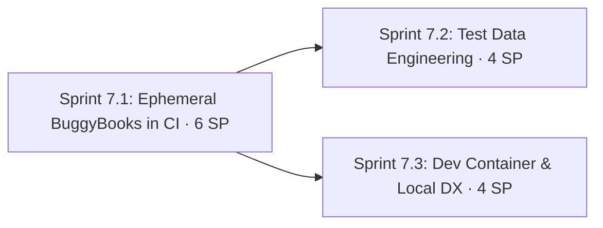

# Phase 7: Hermetic Environments, Test Data & Developer Experience

**Navigation**: [🗺️ Planning Hub](../README.md) | [📖 Roadmap v2](../Master/enhancement_roadmap_v2.md) | [⬅️ Phase 6](phase_6_cicd_integrity_and_supply_chain_security.md) | **[Phase 7]** | [Phase 8 ➡️](phase_8_api_depth_typed_clients_schemas_and_contracts.md)

**Phase Identifier**: `PHASE-7-HERMETIC-ENVIRONMENTS-TEST-DATA-DX`
**Phase Status**: In Progress
**Priority**: P1 / Must
**Total Phase Velocity**: **14 Story Points** (Sprint 7.1: 6 SP [Done], Sprint 7.2: 4 SP, Sprint 7.3: 4 SP)
**Phase Leads**: DevOps Engineer & SDET Architect
**Primary Personas**: DevOps Engineer, SDET Architect, Playwright QA Lead, Selenium Specialist, Performance Engineer

---

## 1. Executive Summary & Phase Theme

Every test run in this monorepo currently depends on **one shared, free-tier Render deployment**:
- 30–60s cold starts force a warm-up probe in every workflow.
- Chaos knobs (`checkoutFailureRate`, `inventoryDelayMs`, `visualChaos`) are **global**, so concurrent runs interfere with each other (AGENTS.md §3 documents the failure mode).
- Rate limits and shared data make results depend on who else is running.
- Load, soak and active security scans can't run responsibly against free hosting.

The BuggyBooks application is our own repo (`munna7862/buggy-books`) and already ships `backend/Dockerfile`, `frontend/Dockerfile` and `docker-compose.yml` (backend :4000 with a healthcheck, frontend served by nginx on :5173).

**Phase 7** publishes BuggyBooks images to **GHCR** (free for public repos) and runs a **fresh, disposable BuggyBooks per CI job**. It also adds a shared test-data engineering package and a one-click dev environment. Render staging is kept as a nightly *deployment contract* check.

---

## 2. Architectural Scope & Target Outcomes

| Workstream | Current State | Phase Target Outcome |
| :--- | :--- | :--- |
| **Environment** | Shared Render staging only | `ENV=DOCKER` profile backed by GHCR images via `infra/docker-compose.test.yml`; Render only nightly |
| **State isolation** | Global chaos state across runs | Each CI job owns its own backend; chaos tests no longer need serialization |
| **Feedback speed** | Warm-up ≤ 90s + network latency | Healthcheck-gated local start (~15s), localhost latency |
| **Test data** | JSON fixtures per spec, ad-hoc `uniqueUsername()` helpers duplicated in specs | `@automationframeworks/test-data`: faker factories, builders, API seeders, cleanup registry |
| **Config validation** | `dotenv` + string defaults | `zod`-validated typed config, fail fast on missing values |
| **Developer onboarding** | Manual install of Chrome, Java, JMeter, k6, Allure | `.devcontainer` (Codespaces-ready), Taskfile, Testcontainers option |

---

## 3. Sprints in this Phase

1. **[Sprint 7.1: Ephemeral BuggyBooks Environment in CI](../Sprints/sprint_7_1_ephemeral_buggybooks_environment_in_ci.md)** — 6 SP
2. **[Sprint 7.2: Test Data Engineering & Typed Configuration](../Sprints/sprint_7_2_test_data_engineering_and_typed_configuration.md)** — 4 SP
3. **[Sprint 7.3: Dev Container & Local Developer Experience](../Sprints/sprint_7_3_dev_container_and_local_developer_experience.md)** — 4 SP

---

## 4. Definition of Done & Quality Acceptance Gates

- [ ] `buggy-books` CI publishes `ghcr.io/munna7862/buggy-books-backend` and `…-frontend` images on every main merge.
- [ ] PR gate runs Playwright smoke against `ENV=DOCKER` with **zero** calls to `onrender.com`.
- [ ] Full Playwright suite passes 3× in a row against `DOCKER` (all 110 tests or documented exclusions).
- [ ] Nightly workflow still validates Render staging (`ENV=STAGING`).
- [ ] At least 5 specs migrated to `@automationframeworks/test-data` builders/seeders as reference implementations.
- [ ] `devcontainer` builds; `task test:pr` runs green inside Codespaces.

---

## 5. Risks, Gotchas & Mitigation Strategies

| Threat / Gotcha | Impact | Mitigation |
| :--- | :--- | :--- |
| `VITE_API_URL` is baked into the frontend **at build time** | Frontend calls the wrong API host | Publish a dedicated `:ci-localhost` frontend tag built with `VITE_API_URL=http://localhost:4000/api`; the browser runs on the runner host, so `localhost` resolves correctly |
| Playwright inside a container (`mcr.microsoft.com/playwright`) can't reach `localhost` of the runner | Docker-mode shards fail | Use `container.options: --network host`, or run compose with `network_mode: host`; document both |
| `docker-compose.yml` mounts a `backend-data` volume (persists `db.json`) | State leaks between runs | `docker-compose.test.yml` has **no volumes**; reset via `POST /api/test/reset` in global setup |
| Visual baselines rendered against Render vs local might differ (fonts, data) | Visual test failures | Recapture baselines against `DOCKER` inside the Playwright image (Sprint 10.2 hardens this) |
| Divergence between Render deploy and GHCR image | Different results by env | Nightly STAGING run is the contract check; images tagged by `buggy-books` commit SHA, recorded in Allure environment |
| Cross-repo change needed in `buggy-books` | Coordination | Sprint 7.1 story US-AF-711 is executed in the `buggy-books` repo with its own PR |
