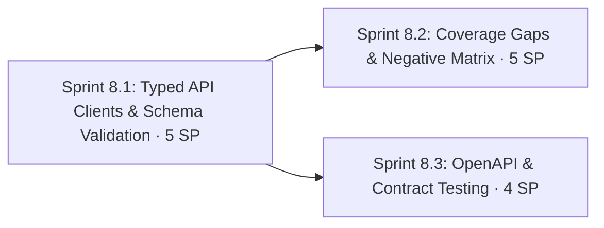

# Phase 8: API Depth — Typed Clients, Schemas & Contract Testing

**Navigation**: [🗺️ Planning Hub](../README.md) | [📖 Roadmap v2](../Master/enhancement_roadmap_v2.md) | [⬅️ Phase 7](phase_7_hermetic_environments_test_data_and_developer_experience.md) | **[Phase 8]** | [Phase 9 ➡️](phase_9_security_testing_dast_and_appsec.md)

**Phase Identifier**: `PHASE-8-API-DEPTH-CLIENTS-SCHEMAS-CONTRACTS`
**Phase Status**: In Progress (Sprint 8.1 & 8.2 Complete)
**Priority**: P1 / Must (8.1, 8.2) · P2 / Should (8.3)
**Total Phase Velocity**: **14 Story Points** (Sprint 8.1: 5 SP, Sprint 8.2: 5 SP, Sprint 8.3: 4 SP)
**Phase Leads**: SDET Architect & Playwright QA Lead
**Primary Personas**: SDET Architect, Playwright QA Lead, DevOps Engineer

---

## 1. Executive Summary & Phase Theme

The 55 Playwright API tests check status codes and selected fields well, but:
- Specs call `request.post(`${apiBase}/api/cart`, …)` directly, with bypass headers repeated inline. The API surface isn't wrapped anywhere.
- Two HTTP stacks coexist (Playwright `APIRequestContext` and `axios` through `ApiUtil`).
- **No response schema validation.** A renamed or removed field passes as long as the asserted fields still exist.
- Endpoints with no coverage (from `buggy-books/backend/src/routes/api.ts` and `app.ts`): `DELETE /api/cart`, `DELETE /api/cart/:bookId`, `POST /api/logout`, `GET /api/metrics`, `GET /api/csrf-token`.
- No negative authorization matrix, no error-envelope consistency check, no Socket.IO API-level tests.
- No OpenAPI spec, no contract testing, no property-based fuzzing.

**Phase 8** adds a typed client layer with schema validation everywhere, closes the coverage gaps with a systematic negative matrix, and introduces **OpenAPI + Schemathesis + Pact** contract testing — all free and OSS, with no broker needed.

---

## 2. Architectural Scope & Target Outcomes

| Workstream | Current State | Phase Target Outcome |
| :--- | :--- | :--- |
| **Client layer** | Raw `request.*` calls in specs | `api.books.list()`, `api.cart.add()` … typed clients exposed as one `api` fixture |
| **Schemas** | None | `zod` schema per resource; `toMatchSchema` custom matcher on every response |
| **Latency in functional tests** | Not asserted | `toRespondWithin(ms)` matcher for per-endpoint budgets |
| **Coverage** | 5 endpoints uncovered | 100% of routed endpoints have ≥ 1 positive + ≥ 1 negative test |
| **AuthZ** | Spot checks | Data-driven matrix: every protected endpoint × 4 token states |
| **Real-time** | UI-level WebSocket test only | Socket.IO client tests (connect, events, chaos drop rate) |
| **Contracts** | None | OpenAPI 3.1 spec (from zod), Schemathesis nightly, Pact consumer + provider verification |

---

## 3. Sprints in this Phase

1. **[Sprint 8.1: Typed API Client Layer & Schema Validation](../Sprints/sprint_8_1_typed_api_client_layer_and_schema_validation.md)** — 5 SP
2. **[Sprint 8.2: API Coverage Gaps & Negative Test Matrix](../Sprints/sprint_8_2_api_coverage_gaps_and_negative_matrix.md)** — 5 SP
3. **[Sprint 8.3: OpenAPI Specification & Contract Testing](../Sprints/sprint_8_3_openapi_specification_and_contract_testing.md)** — 4 SP

---

## 4. Definition of Done & Quality Acceptance Gates

- [x] No API spec calls `request.get/post/put/delete` directly (lint rule enforced); all go through `api.*` clients.
- [x] Every API test response is schema-validated.
- [x] Endpoint coverage report (`scripts/api-coverage.ts`) shows 100% of routes covered.
- [x] Auth matrix runs as one data-driven spec with ≥ 28 generated cases (7 protected endpoints × 4 token states).
- [x] Schemathesis nightly against DOCKER produces a report; any 5xx is triaged into an issue or documented as an intentional bug.
- [x] Pact consumer tests generate a pact file; provider verification passes against the DOCKER backend in CI.
- [x] Both catalogs updated in lockstep with the new `API-*` and `CT-*` IDs.

---

## 5. Risks, Gotchas & Mitigation Strategies

| Threat / Gotcha | Impact | Mitigation |
| :--- | :--- | :--- |
| Refactoring 55 tests to clients changes test behaviour by accident | False confidence | Migrate in small PR-sized batches; test count and titles must be identical before and after (`--list` diff) |
| Intentional bugs make schemas "fail" | Red tests for known behaviour | Use `test.fail()` with a link to `docs/intentional_bugs.md`, or model the known deviation in the schema with a comment |
| Schemathesis finds many 500s at once | Noise | Run nightly, non-blocking at first; triage into the catalog; make it blocking once the baseline is clean |
| Pact without a broker | Pact versioning harder | Use file-based pacts passed as CI artifacts (free); a self-hosted Pact Broker is optional (docker `pactfoundation/pact-broker`) |
| OpenAPI spec drifts from implementation | Contract tests lie | Generate the spec **from the zod schemas** and diff in CI (8.3) |
