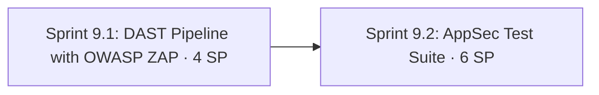

# Phase 9: Security Testing — DAST & AppSec Test Suite

**Navigation**: [🗺️ Planning Hub](../README.md) | [📖 Roadmap v2](../Master/enhancement_roadmap_v2.md) | [⬅️ Phase 8](phase_8_api_depth_typed_clients_schemas_and_contracts.md) | **[Phase 9]** | [Phase 10 ➡️](phase_10_ui_quality_web_vitals_and_framework_parity.md)

**Phase Identifier**: `PHASE-9-SECURITY-TESTING-DAST-APPSEC`
**Phase Status**: Not Started
**Priority**: P2 / Should
**Total Phase Velocity**: **10 Story Points** (Sprint 9.1: 4 SP, Sprint 9.2: 6 SP)
**Phase Leads**: Security Test Engineer (new persona) & SDET Architect
**Primary Personas**: Security Test Engineer, Playwright QA Lead, DevOps Engineer

---

## 1. Executive Summary & Phase Theme

Phase 6 secures the **repository** (SAST, secrets, dependencies). Phase 9 tests the **application** for security defects:
- **DAST** with OWASP ZAP (passive baseline on PR, active API scan nightly), results as SARIF in GitHub code scanning.
- A tagged **`@security` AppSec suite** in Playwright, mapped to the **OWASP API Security Top 10 (2023)** and the relevant OWASP Top 10 web categories.

Notable observations from reading `buggy-books/backend/src/app.ts` that this phase must cover:
- CSRF protection (`csrf-csrf` double-submit) is **skipped** when either `x-bypass-csrf: true` **or** `x-bypass-rate-limit: true` is sent, and these bypasses are honoured in the deployed build. The suite should document this as a finding (intentional or not).
- `x-enforce-csrf: true` forces enforcement, which lets tests prove CSRF works when bypasses are absent.
- `helmet()` and `cors({...})` are configured, so header and CORS assertions have a defined baseline.
- The rate limit is 600 req/min per client in production config.

> **Scope guard (non-negotiable)**: active scanning and attack payloads run **only** against the disposable DOCKER instance (Phase 7) of BuggyBooks, which we own. Against Render staging, only passive checks (headers, cookies, CORS). Never target any third-party host.

---

## 2. Architectural Scope & Target Outcomes

| Workstream | Current State | Phase Target Outcome |
| :--- | :--- | :--- |
| **DAST** | None | ZAP baseline (PR, passive) + ZAP API scan with OpenAPI (nightly, active) on DOCKER |
| **Findings management** | n/a | SARIF in code scanning; `security/zap-rules.tsv` for accepted risks with justification |
| **AppSec specs** | None | ~35 `@security` tests: JWT, IDOR, injection, upload, headers, cookies, CORS, CSRF, brute force, leakage |
| **Traceability** | n/a | Each `SEC-*` catalog entry tagged with an OWASP API Top 10 ID |
| **Persona** | No security role | `role-security-engineer` skill under `.agents/skills/` |

---

## 3. Sprints in this Phase

1. **[Sprint 9.1: DAST Pipeline with OWASP ZAP](../Sprints/sprint_9_1_dast_pipeline_with_owasp_zap.md)** — 4 SP
2. **[Sprint 9.2: AppSec Security Test Suite](../Sprints/sprint_9_2_appsec_security_test_suite.md)** — 6 SP

---

## 4. Definition of Done & Quality Acceptance Gates

- [ ] ZAP baseline runs on every PR against DOCKER and uploads SARIF; no unacknowledged High alerts.
- [ ] ZAP API scan runs nightly against DOCKER using `docs/api/openapi.yaml`.
- [ ] `@security` suite exists with ≥ 30 tests, green (known intentional bugs marked `test.fail()` with references).
- [ ] Every `SEC-*` entry in both catalogs carries an OWASP mapping.
- [ ] `docs/security/security_testing_guide.md` explains the scope guard, tools, how to triage, and how to add tests.
- [ ] `role-security-engineer` persona skill added and referenced from AGENTS.md §7.

---

## 5. Risks, Gotchas & Mitigation Strategies

| Threat / Gotcha | Impact | Mitigation |
| :--- | :--- | :--- |
| Active scan accidentally pointed at Render | Abuse of a shared free host; possible ToS issue | Workflow hard-codes `http://localhost:4000`; a guard step fails if the target isn't localhost |
| Bypass headers in the default client mask real CSRF / rate-limit behaviour | False negatives | Security specs use a dedicated `securityApi` fixture with **no** bypass headers |
| ZAP false positives | Alert fatigue | Rules TSV with `IGNORE`/`WARN` + justification and review date |
| Intentional vulnerabilities exist by design | Permanently red suite | `test.fail()` + link to `docs/intentional_bugs.md` section; new entries added there for newly found intentional bugs |
| XSS tests executing scripts in the browser | Flaky or unsafe | Use a harmless payload (`window.__xss = 1`) and assert it was **not** set |
