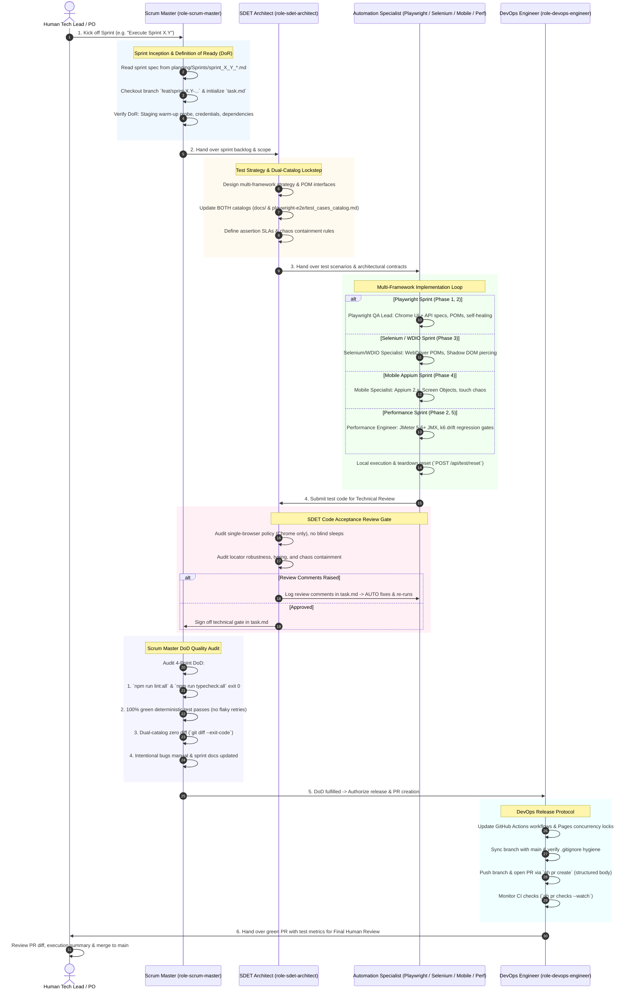

# AutomationFrameworks — Strategic Planning & Delivery Roadmap

This directory houses the complete engineering roadmap, architectural decomposition, and sprint-by-sprint execution specifications for transforming the `AutomationFrameworks` monorepo into an enterprise-grade multi-framework test automation ecosystem.

---

## 🗺️ Planning Architecture & Directory Structure

```text
planning/
├── Master/
│   └── master_plan.md                 # Strategic Master Plan & 10 Transformation Pillars
│
├── Phases/
│   ├── phase_1_monorepo_foundations_pipeline_hygiene_and_utility_unification.md
│   ├── phase_2_documentation_integrity_anti_pattern_manual_and_quality_gates.md
│   ├── phase_3_webdriverio_and_selenium_alignment_to_buggybooks.md
│   ├── phase_4_mobile_automation_appium_and_webdriverio.md
│   └── phase_5_executive_observability_and_unified_allure_dashboard.md
│
├── Sprints/
│   ├── sprint_1_1_workflow_cleanup_and_extensionless_file_purge.md
│   ├── sprint_1_2_standardized_env_templates_and_visual_baseline_calibration.md
│   ├── sprint_1_3_monorepo_workspaces_and_utility_unification.md
│   ├── sprint_2_1_intentional_bugs_and_chaos_testing_guide.md
│   ├── sprint_2_2_dual_engine_performance_strategy_and_k6_migration.md
│   ├── sprint_2_3_unified_pull_request_ci_quality_gate.md
│   ├── sprint_3_1_buggybooks_selenium_page_objects_and_auth_catalog_smoke.md
│   ├── sprint_3_2_buggybooks_wdio_page_objects_and_cart_checkout_flows.md
│   ├── sprint_3_3_cross_framework_parity_assertions_and_traceability_matrix_sync.md
│   ├── sprint_4_1_mobile_automation_monorepo_import_and_scaffolding.md
│   ├── sprint_4_2_appium_android_ios_smoke_and_chaos_e2e_verification.md
│   ├── sprint_4_3_mobile_ci_pipeline_and_emulator_execution_workflows.md
│   ├── sprint_5_1_multi_framework_allure_result_aggregation_architecture.md
│   ├── sprint_5_2_github_pages_portal_landing_page_and_kpi_badging.md
│   └── sprint_5_3_automated_monorepo_health_auditing_and_closed_loop_governance.md
│
└── README.md                          # Executive index (this document)
```

---

## 🏛️ Strategic Master Plan Overview

👉 [**`planning/Master/master_plan.md`**](Master/master_plan.md)

The Master Plan establishes the foundational principles, target architecture, and 10 transformation pillars:
1. **Pillar 1**: Multi-Framework BuggyBooks Parity (Selenium + WebdriverIO).
2. **Pillar 2**: Monorepo Workspaces & `playwright-utils` Package Unification (`@automationframeworks/playwright-utils`).
3. **Pillar 3**: Mobile Test Automation Suite (Appium 2.x + WebdriverIO).
4. **Pillar 4**: Intentional Bugs & Chaos Testing Guide (`docs/intentional_bugs.md`).
5. **Pillar 5**: CI/CD Workflow Modernization & Pipeline Hygiene.
6. **Pillar 6**: Standardized Environment Configuration Templates (`.env.example`).
7. **Pillar 7**: Visual Regression Snapshot Calibration for Project `chrome`.
8. **Pillar 8**: Dual-Engine Performance Strategy (Apache JMeter + k6 Synergy).
9. **Pillar 9**: Unified Pull Request Quality Gate (`pr-gate.yml`).
10. **Pillar 10**: Centralized Multi-Framework Allure Reporting on GitHub Pages.

---

## 📅 The 5 Delivery Phases & 15 Sprints

| Phase & Specification | Theme & Scope | Estimated Velocity | Associated Sprints |
| :--- | :--- | :--- | :--- |
| **[Phase 1](Phases/phase_1_monorepo_foundations_pipeline_hygiene_and_utility_unification.md)** | **Foundations, Pipeline Hygiene & Utility Unification** | **10 SP** | • [Sprint 1.1: Workflow Cleanup & Extensionless Purge](Sprints/sprint_1_1_workflow_cleanup_and_extensionless_file_purge.md) (2 SP)<br>• [Sprint 1.2: Env Templates & Visual Calibration](Sprints/sprint_1_2_standardized_env_templates_and_visual_baseline_calibration.md) (3 SP)<br>• [Sprint 1.3: Monorepo Workspaces & Package Unification](Sprints/sprint_1_3_monorepo_workspaces_and_utility_unification.md) (5 SP) |
| **[Phase 2](Phases/phase_2_documentation_integrity_anti_pattern_manual_and_quality_gates.md)** | **Documentation Integrity, Chaos Manual & Quality Gates** | **12 SP** | • [Sprint 2.1: Intentional Bugs & Chaos Guide](Sprints/sprint_2_1_intentional_bugs_and_chaos_testing_guide.md) (3 SP)<br>• [Sprint 2.2: Dual-Engine Performance & k6 Migration](Sprints/sprint_2_2_dual_engine_performance_strategy_and_k6_migration.md) (5 SP)<br>• [Sprint 2.3: Unified PR CI Quality Gate (pr-gate.yml)](Sprints/sprint_2_3_unified_pull_request_ci_quality_gate.md) (4 SP) |
| **[Phase 3](Phases/phase_3_webdriverio_and_selenium_alignment_to_buggybooks.md)** | **WebdriverIO & Selenium Alignment to BuggyBooks** | **14 SP** | • [Sprint 3.1: Selenium Page Objects & Auth/Catalog Smoke](Sprints/sprint_3_1_buggybooks_selenium_page_objects_and_auth_catalog_smoke.md) (5 SP)<br>• [Sprint 3.2: WDIO Page Objects & Cart/Checkout Flows](Sprints/sprint_3_2_buggybooks_wdio_page_objects_and_cart_checkout_flows.md) (5 SP)<br>• [Sprint 3.3: Cross-Framework Parity & Catalog Sync](Sprints/sprint_3_3_cross_framework_parity_assertions_and_traceability_matrix_sync.md) (4 SP) |
| **[Phase 4](Phases/phase_4_mobile_automation_appium_and_webdriverio.md)** | **Mobile Automation (Appium 2.x + WebdriverIO)** | **14 SP** | • [Sprint 4.1: Mobile Automation Monorepo Import](Sprints/sprint_4_1_mobile_automation_monorepo_import_and_scaffolding.md) (4 SP)<br>• [Sprint 4.2: Appium Android/iOS Smoke & Chaos E2E](Sprints/sprint_4_2_appium_android_ios_smoke_and_chaos_e2e_verification.md) (5 SP)<br>• [Sprint 4.3: Mobile CI Pipeline & Emulator Workflows](Sprints/sprint_4_3_mobile_ci_pipeline_and_emulator_execution_workflows.md) (5 SP) |
| **[Phase 5](Phases/phase_5_executive_observability_and_unified_allure_dashboard.md)** | **Executive Observability & Unified Allure Dashboard** | **13 SP** | • [Sprint 5.1: Multi-Framework Allure Aggregation](Sprints/sprint_5_1_multi_framework_allure_result_aggregation_architecture.md) (4 SP)<br>• [Sprint 5.2: GitHub Pages Portal Landing Page](Sprints/sprint_5_2_github_pages_portal_landing_page_and_kpi_badging.md) (5 SP)<br>• [Sprint 5.3: Automated Health & Governance](Sprints/sprint_5_3_automated_monorepo_health_auditing_and_closed_loop_governance.md) (4 SP) |

---

## 📊 Sprint Execution Matrix & Velocity Rollup (63 Story Points Total)

| Sprint ID | Sprint Title | Phase | Est. SP | Lead Persona | Status |
| :--- | :--- | :--- | :---: | :--- | :---: |
| **SPRINT-1.1** | [Workflow Cleanup & Extensionless File Purge](Sprints/sprint_1_1_workflow_cleanup_and_extensionless_file_purge.md) | Phase 1 | 2 SP | DevOps Engineer | Done |
| **SPRINT-1.2** | [Standardized Env Templates & Visual Baseline Calibration](Sprints/sprint_1_2_standardized_env_templates_and_visual_baseline_calibration.md) | Phase 1 | 3 SP | Playwright QA Lead | Done |
| **SPRINT-1.3** | [Monorepo Workspaces & Utility Package Unification](Sprints/sprint_1_3_monorepo_workspaces_and_utility_unification.md) | Phase 1 | 5 SP | SDET Architect | Done |
| **SPRINT-2.1** | [Intentional Bugs & Chaos Testing Guide](Sprints/sprint_2_1_intentional_bugs_and_chaos_testing_guide.md) | Phase 2 | 3 SP | SDET Architect | Done |
| **SPRINT-2.2** | [Dual-Engine Performance Strategy & k6 Migration](Sprints/sprint_2_2_dual_engine_performance_strategy_and_k6_migration.md) | Phase 2 | 5 SP | Performance Engineer | Done |
| **SPRINT-2.3** | [Unified Pull Request CI Quality Gate (`pr-gate.yml`)](Sprints/sprint_2_3_unified_pull_request_ci_quality_gate.md) | Phase 2 | 4 SP | DevOps Engineer | Done |
| **SPRINT-3.1** | [BuggyBooks Selenium Page Objects & Auth/Catalog Smoke](Sprints/sprint_3_1_buggybooks_selenium_page_objects_and_auth_catalog_smoke.md) | Phase 3 | 5 SP | Selenium Specialist | Done |
| **SPRINT-3.2** | [BuggyBooks WDIO Page Objects & Cart/Checkout Flows](Sprints/sprint_3_2_buggybooks_wdio_page_objects_and_cart_checkout_flows.md) | Phase 3 | 5 SP | Selenium / WDIO QA | Done |
| **SPRINT-3.3** | [Cross-Framework Parity Assertions & Catalog Sync](Sprints/sprint_3_3_cross_framework_parity_assertions_and_traceability_matrix_sync.md) | Phase 3 | 4 SP | SDET Architect | Done |
| **SPRINT-4.1** | [Mobile Automation Monorepo Import & Scaffolding](Sprints/sprint_4_1_mobile_automation_monorepo_import_and_scaffolding.md) | Phase 4 | 4 SP | Mobile QA Specialist | Done |
| **SPRINT-4.2** | [Appium Android/iOS Smoke & Chaos E2E Verification](Sprints/sprint_4_2_appium_android_ios_smoke_and_chaos_e2e_verification.md) | Phase 4 | 5 SP | Mobile QA Specialist | Done |
| **SPRINT-4.3** | [Mobile CI Pipeline & Emulator Execution Workflows](Sprints/sprint_4_3_mobile_ci_pipeline_and_emulator_execution_workflows.md) | Phase 4 | 5 SP | DevOps Engineer | Planned |
| **SPRINT-5.1** | [Multi-Framework Allure Aggregation Architecture](Sprints/sprint_5_1_multi_framework_allure_result_aggregation_architecture.md) | Phase 5 | 4 SP | DevOps Engineer | Planned |
| **SPRINT-5.2** | [GitHub Pages Portal Landing Page & Executive KPI Badging](Sprints/sprint_5_2_github_pages_portal_landing_page_and_kpi_badging.md) | Phase 5 | 5 SP | SDET Architect | Planned |
| **SPRINT-5.3** | [Automated Monorepo Health Auditing & Closed-Loop Governance](Sprints/sprint_5_3_automated_monorepo_health_auditing_and_closed_loop_governance.md) | Phase 5 | 4 SP | SDET Architect | Planned |
| **TOTAL** | **15 Sprints across 5 Phases** | **All** | **63 SP** | **Virtual Sprint Team** | **Active Roadmap** |

---

## 👥 Virtual Sprint Team Matrix

Every sprint is executed through a specialized 7-agent persona team defined in `.agents/skills/`:

```
               ┌────────────────────────────────────────────────────────┐
               │              Virtual Sprint Team (7 Roles)             │
               └──────────────────────────┬─────────────────────────────┘
                                          │
                               ┌──────────▼──────────┐
                               │    Scrum Master     │
                               │ (Agile / Velocity)  │
                               └──────────┬──────────┘
                                          │
       ┌──────────────────┬───────────────┼───────────────┬──────────────────┐
       ▼                  ▼               ▼               ▼                  ▼
┌──────────────┐   ┌──────────────┐┌──────────────┐┌──────────────┐   ┌──────────────┐
│SDET Architect│   │Playwright QA ││ Selenium QA  ││  Mobile QA   │   │ Performance  │
│  (Lead / DoD)│   │(Chrome + API)││ (WebDriver)  ││ (Appium 2.x) │   │ (JMeter + k6)│
└──────┬───────┘   └──────┬───────┘└──────┬───────┘└──────┬───────┘   └──────┬───────┘
       │                  │               │               │                  │
       └──────────────────┴───────────────┼───────────────┴──────────────────┘
                                          │
                               ┌──────────▼──────────┐
                               │ DevOps & Release    │
                               │ (CI/CD + PR Gates)  │
                               └─────────────────────┘
```

1. [**`role-scrum-master`**](../.agents/skills/role-scrum-master/SKILL.md): Sprint ceremony facilitation, 63 SP velocity tracking, DoR/DoD enforcement, blocker removal.
2. [**`role-sdet-architect`**](../.agents/skills/role-sdet-architect/SKILL.md): Strategy, dual-catalog sync, monorepo workspaces, Quality Gates.
3. [**`role-playwright-automation`**](../.agents/skills/role-playwright-automation/SKILL.md): Google Chrome UI + API specs, POMs, self-healing, visual regression.
4. [**`role-selenium-specialist`**](../.agents/skills/role-selenium-specialist/SKILL.md): Selenium WebDriver TypeScript, BuggyBooks POMs, ChromeDriver headless, Shadow DOM.
5. [**`role-mobile-appium-specialist`**](../.agents/skills/role-mobile-appium-specialist/SKILL.md): Appium 2.x + WebdriverIO, Screen Objects, gestures, mobile chaos.
6. [**`role-performance-engineer`**](../.agents/skills/role-performance-engineer/SKILL.md): Apache JMeter 5.6+ enterprise stress plans and k6 baseline drift gates.
7. [**`role-devops-engineer`**](../.agents/skills/role-devops-engineer/SKILL.md): CI/CD pipelines, Render warm-up probes, Allure Pages deployment, PR release lifecycle.

---

## 🔄 Sprint Execution Lifecycle & Persona Handover Flow

Every sprint follows an automated 6-stage persona handover loop:



---

## 📋 Centralized Active Sprint Tracking (`task.md`)

When any sprint starts, the Scrum Master initializes [`task.md`](../task.md) at the repository root using [`task.template.md`](../task.template.md). This file serves as the live state machine tracking:
1. **Active Sprint & Velocity**: Sprint ID, Phase, Story Points, Goal.
2. **Persona Ownership**: Assigned specialist personas for that sprint.
3. **Granular Checklist**: User stories broken down into sub-tasks with persona labels (`[SM]`, `[SDET]`, `[QA]`, `[DevOps]`).
4. **Quality Gates & Review Sign-Off**:
   - `Pre-Flight Architecture Gate` (SDET Architect)
   - `Code Acceptance Review Gate` (SDET Architect)
   - `DoD & Governance Gate` (Scrum Master)
   - `CI/CD & Release Gate` (DevOps Engineer)
5. **Execution Evidence**: Verification commands, test counts, pass rates.

